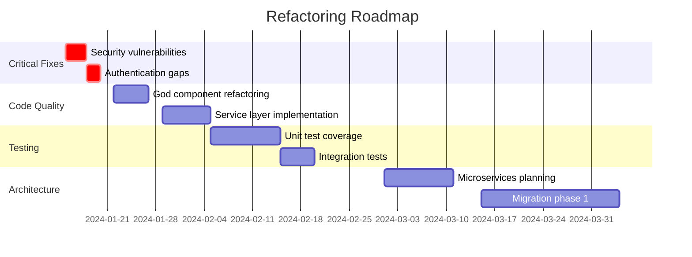

# Code Review Command

**Command:** `/quality:code-review`
**Agents:** `code-architect`, `security-audit-specialist`, `accessibility-expert`, `qa-test-engineer`, `the-critic`
**Complexity:** Medium-High
**Duration:** 2-8 hours (depends on scope and codebase size)

## Overview

Comprehensive code review command that provides flexible review depth through configurable levels. From quick component reviews to deep architectural analysis, this command coordinates specialized agents to evaluate code quality, maintainability, security, testing, and architectural integrity.

## Command Options

```bash
# Default comprehensive review (all levels)
/quality:code-review

# Component-level review (quick, focused)
/quality:code-review --level=component

# Quality review (maintainability focus)
/quality:code-review --level=quality

# Architecture review (system-wide analysis)
/quality:code-review --level=architecture

# Comprehensive review (all aspects)
/quality:code-review --level=comprehensive

# Target specific paths
/quality:code-review --path=src/components/UserDashboard
/quality:code-review --path=src/services

# Focus on specific aspects
/quality:code-review --focus=security,performance
/quality:code-review --focus=readability,testing

# Review PR changes only
/quality:code-review --pr=123

# Set severity threshold
/quality:code-review --severity=high

# Output format
/quality:code-review --output=markdown
/quality:code-review --output=json
```

## Review Levels

### Level 1: Component Review (2-3 hours)
**Focus:** Individual components, modules, or features
**Depth:** Implementation details and local quality

**Scope:**
- Logic errors and potential bugs
- Performance issues and inefficiencies
- Code organization and structure
- Error handling patterns
- Memory management
- Thread safety considerations

**Agents Involved:**
- `code-architect` - Code quality and patterns
- `qa-test-engineer` - Test coverage gaps

**Deliverables:**
- Component quality scorecard
- Bug and issue list
- Refactoring suggestions
- Test coverage analysis

### Level 2: Quality Review (4-6 hours)
**Focus:** Code maintainability and long-term health
**Depth:** Cross-component patterns and technical debt

**Scope:**
- Architecture patterns and anti-patterns
- Code readability and maintainability
- SOLID principles adherence
- Design patterns usage
- Technical debt identification
- Documentation completeness
- Test quality and coverage

**Agents Involved:**
- `code-architect` - Architecture and maintainability
- `qa-test-engineer` - Test strategy and coverage
- `security-audit-specialist` - Security vulnerabilities

**Deliverables:**
- Maintainability index report
- Technical debt assessment
- Security vulnerability report
- Test coverage and quality analysis
- Refactoring roadmap

### Level 3: Architecture Review (6-8 hours)
**Focus:** System-wide architecture and strategic design
**Depth:** Full system analysis with future scalability

**Scope:**
- Overall architectural approach
- Technology stack appropriateness
- Scalability and performance implications
- Security architecture patterns
- Infrastructure and deployment architecture
- Data architecture and flow
- Integration patterns
- Future evolution planning

**Agents Involved:**
- `code-architect` - System architecture
- `the-critic` - Strategic assessment
- `security-audit-specialist` - Security architecture
- `accessibility-expert` - Accessibility compliance (for UI)
- `qa-test-engineer` - Testing architecture

**Deliverables:**
- Architecture assessment report
- Strategic recommendations
- Risk assessment matrix
- Evolution roadmap
- Compliance validation

### Level 4: Comprehensive Review (8+ hours)
**Focus:** Complete analysis across all dimensions
**Depth:** Everything from syntax to strategy

Combines all levels above with additional:
- Business alignment validation
- Cost optimization analysis
- Team dynamics assessment
- Knowledge management review
- Operational readiness
- Compliance and regulatory review

## Review Dimensions

### Code Quality Assessment
**Lead:** `code-architect`

**Structural Analysis:**
- Code organization and module boundaries
- Dependency management and coupling
- Cyclomatic complexity analysis
- Code duplication detection
- Dead code identification
- Naming conventions consistency

**Pattern Analysis:**
```javascript
// Example issues detected
// ❌ God Component (too many responsibilities)
class UserDashboard extends React.Component {
  // 892 lines, 18 methods, 7 different concerns
  handleUserProfile() { /* ... */ }
  handlePayments() { /* ... */ }
  handleAnalytics() { /* ... */ }
  handleNotifications() { /* ... */ }
  handleSettings() { /* ... */ }
  handleAdmin() { /* ... */ }
  renderEverything() { /* ... */ }
}

// ✅ Refactored (single responsibility)
class UserDashboard extends React.Component {
  render() {
    return (
      <DashboardLayout>
        <UserProfile user={this.props.user} />
        <PaymentSection payments={this.props.payments} />
        <AnalyticsPanel data={this.props.analytics} />
        <NotificationCenter notifications={this.props.notifications} />
        <SettingsPanel settings={this.props.settings} />
        {this.props.isAdmin && <AdminControls />}
      </DashboardLayout>
    );
  }
}
```

**SOLID Principles Evaluation:**
- Single Responsibility: Component/class focus
- Open/Closed: Extension without modification
- Liskov Substitution: Interface compliance
- Interface Segregation: Minimal interfaces
- Dependency Inversion: Abstraction usage

**Maintainability Metrics:**
| Metric | Target | Current | Status |
|--------|--------|---------|--------|
| Maintainability Index | >70 | 68 | ⚠️ |
| Cyclomatic Complexity | <10 | 4.2 | ✅ |
| Code Duplication | <3% | 5.8% | ❌ |
| Test Coverage | >80% | 58% | ❌ |
| Documentation | >80% | 32% | ❌ |

### Security Review
**Lead:** `security-audit-specialist`

**Vulnerability Assessment:**
- SQL injection risks
- XSS vulnerabilities
- Authentication flaws
- Authorization gaps
- Input validation issues
- Cryptographic weaknesses
- Dependency vulnerabilities

**Security Code Patterns:**
```javascript
// ❌ SQL Injection Risk
const query = `SELECT * FROM users WHERE id = ${userId}`;

// ✅ Parameterized Query
const query = 'SELECT * FROM users WHERE id = ?';
db.execute(query, [userId]);

// ❌ XSS Vulnerability
<div dangerouslySetInnerHTML={{__html: userInput}} />

// ✅ Safe Rendering
<div>{sanitize(userInput)}</div>

// ❌ Hardcoded Secrets
const apiKey = "sk_live_abcd1234";

// ✅ Environment Variables
const apiKey = process.env.API_KEY;
```

**Compliance Validation:**
- OWASP Top 10 coverage
- GDPR compliance (data handling)
- PCI DSS compliance (payment data)
- HIPAA compliance (health data)
- SOC 2 requirements

### Accessibility Review
**Lead:** `accessibility-expert` (for UI code)

**WCAG Compliance:**
- Level A requirements (minimum)
- Level AA requirements (standard)
- Level AAA requirements (enhanced)

**Accessibility Patterns:**
```jsx
// ❌ Missing Accessibility
<div onClick={handleClick}>Click me</div>


// ✅ Accessible Implementation
<button onClick={handleClick} aria-label="Submit form">
  Click me
</button>

```

### Testing Assessment
**Lead:** `qa-test-engineer`

**Test Coverage Analysis:**
- Line coverage percentage
- Branch coverage percentage
- Function coverage percentage
- Statement coverage percentage

**Test Quality Evaluation:**
```javascript
// ❌ Poor Test (implementation-focused)
it('should call setState', () => {
  const spy = jest.spyOn(component, 'setState');
  component.handleClick();
  expect(spy).toHaveBeenCalled();
});

// ✅ Good Test (behavior-focused)
it('should display error message on invalid input', () => {
  render(<LoginForm />);
  fireEvent.change(screen.getByLabelText('Email'), {
    target: { value: 'invalid-email' }
  });
  fireEvent.click(screen.getByRole('button', { name: 'Submit' }));
  expect(screen.getByText('Please enter a valid email')).toBeInTheDocument();
});
```

**Test Gaps Identification:**
- Untested critical paths
- Missing edge cases
- Inadequate error scenarios
- Performance test gaps
- Security test coverage

### Strategic Assessment
**Lead:** `the-critic` (architecture level only)

**Technology Evaluation:**
- Framework selection appropriateness
- Library choices justification
- Build tool effectiveness
- Deployment strategy alignment

**Risk Analysis:**
- Technical debt accumulation
- Scaling limitations
- Security vulnerabilities
- Knowledge concentration
- Vendor lock-in

**Future-Readiness:**
- Extensibility assessment
- Modernization pathway
- Team capability alignment
- Market evolution readiness

## Review Process

### Phase 1: Code Analysis
**Duration:** 30-60 minutes per level

**Automated Analysis:**
```bash
# Static analysis
eslint src/ --format json > eslint-report.json
tsc --noEmit
sonarqube-scanner

# Security scanning
npm audit
snyk test
semgrep --config=auto

# Test coverage
jest --coverage
nyc report

# Complexity analysis
plato -r -d reports src/
```

**Manual Inspection:**
- Architecture pattern review
- Code clarity assessment
- Business logic validation
- Performance hotspot identification

### Phase 2: Issue Identification
**Duration:** 1-2 hours per level

**Issue Categorization:**
| Category | Severity | Examples | Action |
|----------|----------|----------|--------|
| Critical | P0 | Security vulnerabilities, data loss risks | Fix immediately |
| High | P1 | Performance bottlenecks, major bugs | Fix this sprint |
| Medium | P2 | Code smells, minor bugs, tech debt | Plan for next sprint |
| Low | P3 | Style issues, documentation gaps | Backlog |

**Root Cause Analysis:**
- Pattern identification across issues
- Systemic problem detection
- Knowledge gap identification
- Process improvement opportunities

### Phase 3: Recommendation Development
**Duration:** 30-60 minutes per level

**Quick Wins:**
- Automated fixes (linting, formatting)
- Simple refactorings
- Documentation updates
- Test additions

**Strategic Improvements:**
- Architecture refactoring
- Pattern implementation
- Framework migration
- Tool adoption

### Phase 4: Report Generation
**Duration:** 30 minutes

**Executive Summary:**
```markdown
# Code Review Report
**Date:** 2024-01-15
**Scope:** UserManagement Module
**Level:** Quality Review
**Overall Score:** 72/100 (Needs Improvement)

## Key Findings
- ✅ Good separation of concerns
- ✅ Consistent coding style
- ⚠️ Test coverage below target (58% vs 80%)
- ❌ 3 critical security vulnerabilities
- ❌ High technical debt in authentication module

## Immediate Actions Required
1. Fix SQL injection vulnerability in UserService.ts:145
2. Update vulnerable dependencies (8 high, 12 medium)
3. Add input validation to all API endpoints

## Recommendations
- Increase test coverage to 80% (add ~120 tests)
- Refactor UserDashboard component (split into 5 components)
- Implement service layer for API calls
- Add performance monitoring
```

## Deliverables

### 1. Code Review Report

**Structure:**
```markdown
# Comprehensive Code Review Report

## Executive Summary
- Review scope and level
- Overall code health score
- Critical findings count
- Key recommendations

## Detailed Findings

### Code Quality (Score: 72/100)
#### Strengths
- Well-organized module structure
- Consistent naming conventions
- Good use of TypeScript

#### Issues
- **Critical (3)**
  - SQL injection in UserService.ts:145
  - Hardcoded credentials in config.ts:23
  - Missing authentication on /admin endpoints

- **High Priority (12)**
  - God component: UserDashboard.tsx (892 lines)
  - N+1 queries in ProductList component
  - Memory leak in WebSocket handler
  - [9 more...]

- **Medium Priority (28)**
  - Code duplication across 15 files
  - Complex functions exceeding 50 lines
  - Missing error boundaries
  - [25 more...]

### Security Assessment
- OWASP Top 10 compliance: 7/10 ⚠️
- Dependency vulnerabilities: 8 high, 12 medium
- Authentication issues: 3
- Authorization gaps: 5

### Test Coverage
- Overall: 58% (target: 80%)
- Critical paths: 72%
- Edge cases: 34%
- Error scenarios: 41%

### Architecture Analysis
- Coupling: Moderate (some circular dependencies)
- Cohesion: Good (clear module boundaries)
- Scalability: Limited (monolithic structure)
- Maintainability: Fair (technical debt accumulation)

## Prioritized Action Items

### Immediate (This Week)
1. Fix critical security vulnerabilities
2. Update vulnerable dependencies
3. Add authentication to admin endpoints

### Short-term (Next Sprint)
1. Refactor god components
2. Increase test coverage to 80%
3. Implement service layer

### Long-term (Next Quarter)
1. Migrate to microservices architecture
2. Implement comprehensive monitoring
3. Establish performance budgets
```

### 2. Issue Tracking Integration

**JIRA/GitHub Issues Format:**
```yaml
- title: "[CRITICAL] SQL Injection in UserService"
  type: bug
  priority: P0
  component: backend/services
  description: |
    SQL injection vulnerability found in UserService.ts:145
    Query uses string concatenation instead of parameterization
  reproduction: |
    POST /api/users?id=1; DROP TABLE users;--
  fix: |
    Use parameterized queries:
    const query = 'SELECT * FROM users WHERE id = ?';
    db.execute(query, [userId]);
```

### 3. Refactoring Roadmap

**Phased Approach:**


### 4. Metrics Dashboard

**Code Quality Metrics:**
```javascript
{
  "metrics": {
    "maintainability": {
      "score": 72,
      "trend": "+3",
      "target": 80
    },
    "complexity": {
      "average": 4.2,
      "max": 18,
      "target": "<10"
    },
    "duplication": {
      "percentage": 5.8,
      "files": 156,
      "target": "<3%"
    },
    "coverage": {
      "line": 58,
      "branch": 42,
      "target": 80
    },
    "security": {
      "vulnerabilities": {
        "critical": 3,
        "high": 8,
        "medium": 12,
        "low": 34
      }
    }
  }
}
```

### 5. Best Practices Guide

**Team-Specific Guidelines:**
```markdown
# Code Review Best Practices

## Based on Review Findings

### Component Structure
- Max 300 lines per component
- Single responsibility principle
- Extract reusable hooks
- Proper prop typing

### Testing Standards
- Minimum 80% coverage
- Test behavior, not implementation
- Include error scenarios
- Performance benchmarks

### Security Requirements
- No hardcoded secrets
- Parameterized queries only
- Input validation on all endpoints
- Regular dependency updates

### Documentation
- JSDoc for all public APIs
- README for each module
- Architecture decision records
- Inline comments for complex logic
```

## Success Metrics

### Code Quality Targets
- **Maintainability Index:** >80
- **Test Coverage:** >80%
- **Cyclomatic Complexity:** <10 average
- **Code Duplication:** <3%
- **Documentation Coverage:** >80%

### Security Targets
- **Critical Vulnerabilities:** 0
- **High Vulnerabilities:** 0
- **OWASP Compliance:** 10/10
- **Dependency Updates:** Monthly
- **Security Training:** Quarterly

### Review Effectiveness
- **Issues Found:** Comprehensive coverage
- **False Positives:** <5%
- **Time to Review:** Within SLA
- **Developer Satisfaction:** >4/5
- **Issue Resolution Rate:** >90%

## Integration Points

### CI/CD Pipeline
```yaml
# GitHub Actions integration
name: Code Review
on:
  pull_request:
    types: [opened, synchronize]

jobs:
  code-review:
    runs-on: ubuntu-latest
    steps:
      - uses: actions/checkout@v3

      - name: Component Review
        run: |
          npm run lint
          npm run type-check
          npm run test:coverage

      - name: Security Review
        run: |
          npm audit
          snyk test
          semgrep --config=auto

      - name: Quality Gates
        run: |
          coverage=$(cat coverage/lcov.info | grep "LF:" | awk '{sum+=$2} END {print sum}')
          if [ "$coverage" -lt 80 ]; then
            echo "Coverage below 80%"
            exit 1
          fi
```

### IDE Integration
```json
// VS Code settings.json
{
  "editor.formatOnSave": true,
  "eslint.autoFixOnSave": true,
  "typescript.tsserver.experimental.enableProjectDiagnostics": true,
  "sonarjs.rules": {
    "cognitive-complexity": "error",
    "no-duplicate-string": "error",
    "no-identical-functions": "error"
  }
}
```

## Common Patterns & Anti-Patterns

### Patterns to Encourage

**Composition over Inheritance:**
```javascript
// ✅ Good: Composition
const withAuth = (Component) => (props) => {
  const auth = useAuth();
  return auth.isAuthenticated ?
    <Component {...props} auth={auth} /> :
    <Redirect to="/login" />;
};

// ❌ Avoid: Deep inheritance
class AuthenticatedComponent extends BaseComponent extends Component
```

**Dependency Injection:**
```javascript
// ✅ Good: Injected dependencies
class UserService {
  constructor(private api: ApiClient, private cache: CacheService) {}
}

// ❌ Avoid: Hard-coded dependencies
class UserService {
  constructor() {
    this.api = new ApiClient();
    this.cache = new CacheService();
  }
}
```

**Error Handling:**
```javascript
// ✅ Good: Comprehensive error handling
try {
  const result = await riskyOperation();
  return { success: true, data: result };
} catch (error) {
  logger.error('Operation failed', { error, context });
  if (error instanceof ValidationError) {
    return { success: false, error: error.message };
  }
  throw new ApplicationError('Operation failed', error);
}

// ❌ Avoid: Silent failures
try {
  return await riskyOperation();
} catch {
  return null;
}
```

## Review Frequency

### Recommended Schedule
- **Component Review:** Every PR
- **Quality Review:** Weekly for active modules
- **Architecture Review:** Monthly
- **Comprehensive Review:** Quarterly

### Trigger Conditions
- New team member onboarding
- Major feature implementation
- Pre-release validation
- Post-incident analysis
- Technical debt sprint

## Related Commands

- `/quality:performance-optimization` - Performance analysis and optimization
- `/quality:testing-strategy` - Test coverage and strategy
- `/security-audit` - Deep security assessment
- `/quality:architecture-review` - Pure architecture focus
- `/development:refactor-component` - Execute refactoring recommendations

## Notes

**Review Philosophy:** Code review is not about finding fault but about maintaining high standards, sharing knowledge, and continuous improvement. Every review should be constructive and educational.

**Automation vs. Manual:** This command combines automated analysis tools with human expertise. Automated tools catch mechanical issues; human review catches design flaws and business logic errors.

**Team Dynamics:** Reviews should rotate among team members to spread knowledge and avoid single points of expertise. Consider pairing junior and senior developers for reviews.

**Continuous Improvement:** Track metrics over time to identify trends. Celebrate improvements and learn from regressions. Regular retrospectives on the review process itself.

**Cultural Considerations:** Adapt review style to team culture. Some teams prefer detailed nitpicking; others focus on high-level issues. Find the right balance for your team.