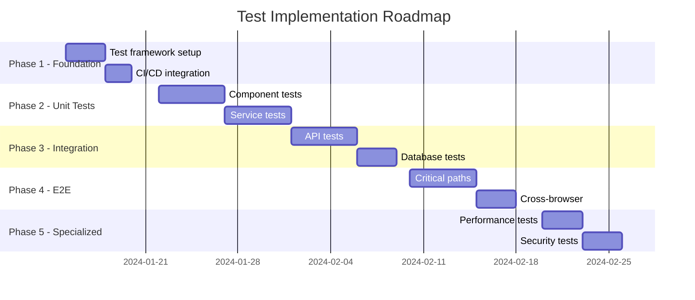

# Testing Strategy Command

**Command:** `/quality:testing-strategy`
**Agents:** `qa-test-engineer`, `test-automation-engineer`, `full-stack-architect`, `security-audit-specialist`, `mobile-developer`, `frontend-performance-specialist`
**Complexity:** Medium-High
**Duration:** 4-8 hours (varies by domain and scope)

## Overview

Comprehensive testing strategy command that provides domain-specific testing approaches through configurable options. Whether you need web application testing, API testing, mobile testing, or comprehensive coverage across all domains, this command coordinates specialized agents to design complete test strategies including unit, integration, E2E, performance, and security testing with full CI/CD integration.

## Command Options

```bash
# Default comprehensive testing strategy (all domains)
/quality:testing-strategy

# Domain-specific strategies
/quality:testing-strategy --domain=web
/quality:testing-strategy --domain=api
/quality:testing-strategy --domain=mobile
/quality:testing-strategy --domain=integration
/quality:testing-strategy --domain=e2e
/quality:testing-strategy --domain=comprehensive

# Focus on specific test types
/quality:testing-strategy --types=unit,integration
/quality:testing-strategy --types=e2e,performance
/quality:testing-strategy --types=security,accessibility

# Target specific architecture
/quality:testing-strategy --architecture=microservices
/quality:testing-strategy --architecture=monolith
/quality:testing-strategy --architecture=serverless

# Include mobile platforms
/quality:testing-strategy --mobile=ios,android
/quality:testing-strategy --mobile=react-native
/quality:testing-strategy --mobile=flutter

# Output format
/quality:testing-strategy --output=markdown
/quality:testing-strategy --output=confluence
```

## Testing Domains

### Domain: Web Application Testing
**Lead Agent:** `qa-test-engineer`
**Supporting:** `frontend-performance-specialist`, `security-audit-specialist`

**Test Categories:**
- Unit tests for components and utilities
- Integration tests for feature workflows
- E2E tests for critical user journeys
- Visual regression testing
- Cross-browser compatibility
- Performance testing (Core Web Vitals)
- Accessibility testing (WCAG compliance)

**Framework Stack:**
```javascript
// Jest for unit and integration testing
describe('UserComponent', () => {
  it('should render user profile correctly', () => {
    const user = { name: 'John Doe', email: 'john@example.com' };
    const { getByText } = render(<UserComponent user={user} />);
    expect(getByText('John Doe')).toBeInTheDocument();
    expect(getByText('john@example.com')).toBeInTheDocument();
  });
});

// Playwright for E2E testing
test('user can complete checkout flow', async ({ page }) => {
  await page.goto('/products');
  await page.click('[data-testid="add-to-cart"]');
  await page.click('[data-testid="checkout"]');
  await page.fill('[name="email"]', 'test@example.com');
  await page.fill('[name="card"]', '4242424242424242');
  await page.click('[type="submit"]');
  await expect(page).toHaveURL('/order-confirmation');
});

// Percy for visual regression
percySnapshot(page, 'Homepage - Desktop');
percySnapshot(page, 'Homepage - Mobile', { widths: [375] });
```

**Coverage Targets:**
- Unit tests: 80% code coverage
- Integration tests: Critical paths 100%
- E2E tests: 10-20 user journeys
- Visual regression: Key pages/states
- Performance: Core Web Vitals "Good"

### Domain: API Testing
**Lead Agent:** `qa-test-engineer`
**Supporting:** `full-stack-architect`, `security-audit-specialist`

**Test Categories:**
- Functional API testing (request/response validation)
- Contract testing (OpenAPI/GraphQL compliance)
- Integration testing (service dependencies)
- Security testing (OWASP API Top 10)
- Performance testing (latency, throughput)
- Error handling and edge cases

**Framework Stack:**
```javascript
// Supertest for REST API testing
describe('POST /api/users', () => {
  it('should create user with valid data', async () => {
    const response = await request(app)
      .post('/api/users')
      .send({ email: 'test@example.com', name: 'Test User' })
      .expect(201);

    expect(response.body).toHaveProperty('id');
    expect(response.body.email).toBe('test@example.com');
  });

  it('should reject invalid email', async () => {
    await request(app)
      .post('/api/users')
      .send({ email: 'invalid', name: 'Test' })
      .expect(400);
  });
});

// Pact for contract testing
describe('User Service Contract', () => {
  it('should fetch user by ID', async () => {
    await provider.addInteraction({
      state: 'user 123 exists',
      uponReceiving: 'a request for user 123',
      withRequest: {
        method: 'GET',
        path: '/api/users/123'
      },
      willRespondWith: {
        status: 200,
        body: { id: '123', email: 'user@example.com' }
      }
    });
  });
});

// k6 for load testing
export default function() {
  const res = http.post('https://api.example.com/users', payload, params);
  check(res, {
    'status is 201': (r) => r.status === 201,
    'response time < 200ms': (r) => r.timings.duration < 200,
  });
}
```

**Coverage Targets:**
- Endpoint coverage: >95%
- Contract compliance: 100%
- Security vulnerabilities: 0 critical/high
- Performance SLOs: P95 <200ms
- Error scenarios: 100% coverage

### Domain: Mobile Testing
**Lead Agent:** `mobile-developer`
**Supporting:** `qa-test-engineer`, `security-audit-specialist`

**Test Categories:**
- Unit tests for business logic
- Widget/component tests (Flutter/React Native)
- Integration tests for native features
- E2E tests on real devices
- Performance testing (app size, startup time)
- Platform-specific testing (iOS/Android)

**Framework Stack:**
```javascript
// React Native Testing
describe('LoginScreen', () => {
  it('should show validation error for invalid email', () => {
    const { getByTestId, getByText } = render(<LoginScreen />);
    fireEvent.changeText(getByTestId('email-input'), 'invalid');
    fireEvent.press(getByTestId('submit-button'));
    expect(getByText('Invalid email address')).toBeTruthy();
  });
});

// Detox for E2E testing (React Native)
describe('User Journey', () => {
  it('should complete onboarding flow', async () => {
    await device.launchApp();
    await element(by.id('get-started')).tap();
    await element(by.id('email')).typeText('test@example.com');
    await element(by.id('continue')).tap();
    await expect(element(by.text('Welcome!'))).toBeVisible();
  });
});

// Appium for cross-platform E2E
const driver = await wdio.remote(opts);
await driver.findElement('accessibility id', 'login').click();
await driver.findElement('class name', 'XCUIElementTypeTextField').sendKeys('user@example.com');
```

**Coverage Targets:**
- Unit tests: 80% code coverage
- Widget tests: All custom components
- Integration tests: Native feature interactions
- E2E tests: Critical user flows
- Device matrix: Top 10 devices

### Domain: Integration Testing
**Lead Agent:** `full-stack-architect`
**Supporting:** `qa-test-engineer`, `test-automation-engineer`

**Test Categories:**
- Service-to-service communication
- Database integration
- Message queue integration
- Third-party API integration
- Data consistency validation
- Transaction testing

**Framework Stack:**
```javascript
// TestContainers for database testing
const container = await new PostgreSQLContainer()
  .withDatabase('testdb')
  .withUsername('test')
  .withPassword('test')
  .start();

// Service integration testing
describe('Order Processing Service', () => {
  it('should process order through all services', async () => {
    // Create order in Order Service
    const order = await orderService.create({ items: [...] });

    // Verify payment processed
    const payment = await paymentService.getByOrderId(order.id);
    expect(payment.status).toBe('completed');

    // Verify inventory updated
    const inventory = await inventoryService.getStock(items[0].sku);
    expect(inventory.quantity).toBe(previousQuantity - 1);

    // Verify notification sent
    const notifications = await notificationService.getByUserId(userId);
    expect(notifications).toContainEqual(
      expect.objectContaining({ type: 'order_confirmation' })
    );
  });
});
```

**Coverage Targets:**
- Service integration: 100% critical paths
- Database operations: All CRUD operations
- Message handling: All event types
- External APIs: Mock coverage 100%
- Transaction scenarios: All business flows

### Domain: End-to-End Testing
**Lead Agent:** `qa-test-engineer`
**Supporting:** `test-automation-engineer`

**Test Categories:**
- Complete user journey validation
- Cross-service workflows
- Multi-platform scenarios
- Data consistency across systems
- Performance under realistic conditions

**Framework Stack:**
```javascript
// Cypress for web E2E
describe('Complete Purchase Flow', () => {
  it('should allow user to purchase product', () => {
    cy.visit('/');
    cy.login('user@example.com', 'password');

    // Search and add product
    cy.get('[data-cy=search]').type('laptop');
    cy.get('[data-cy=product-card]').first().click();
    cy.get('[data-cy=add-to-cart]').click();

    // Checkout
    cy.get('[data-cy=cart-icon]').click();
    cy.get('[data-cy=checkout]').click();

    // Payment
    cy.fillPaymentForm({
      cardNumber: '4242424242424242',
      expiry: '12/25',
      cvc: '123'
    });
    cy.get('[data-cy=place-order]').click();

    // Verification
    cy.url().should('include', '/order-confirmation');
    cy.contains('Order placed successfully');
  });
});
```

**Coverage Targets:**
- Critical paths: 100% coverage
- User journeys: Top 20 scenarios
- Cross-browser: Chrome, Firefox, Safari, Edge
- Mobile responsive: Key breakpoints
- Performance: User-acceptable response times

## Testing Phases

### Phase 1: Test Requirements & Coverage Goals (1 hour)
**Lead:** `qa-test-engineer`

**Activities:**
- Analyze application architecture
- Identify critical business flows
- Define test pyramid distribution
- Establish coverage goals
- Create risk assessment matrix
- Define acceptance criteria

**Deliverables:**
- Test requirements document
- Coverage goals by layer
- Risk assessment matrix
- Test pyramid strategy (70/20/10)
- Quality gates definition

**Test Pyramid Distribution:**
```
       /\        E2E Tests (10%)
      /  \       - Critical user journeys
     /    \      - Cross-service workflows
    /      \
   /--------\    Integration Tests (20%)
  /          \   - API integration
 /            \  - Database operations
/              \ - Service communication
----------------  Unit Tests (70%)
                 - Business logic
                 - Component behavior
                 - Utility functions
```

### Phase 2: Test Framework Setup (2 hours)
**Lead:** `test-automation-engineer`

**Activities:**
- Configure test frameworks
- Set up test environments
- Implement test utilities
- Configure mocking strategies
- Set up test data management
- Integrate CI/CD pipelines

**Framework Configuration:**
```javascript
// jest.config.js
module.exports = {
  projects: [
    {
      displayName: 'unit',
      testMatch: ['<rootDir>/src/**/*.test.js'],
      coverageThreshold: {
        global: {
          branches: 80,
          functions: 80,
          lines: 80,
          statements: 80
        }
      }
    },
    {
      displayName: 'integration',
      testMatch: ['<rootDir>/tests/integration/**/*.test.js'],
      setupFilesAfterEnv: ['<rootDir>/tests/setup/integration.js']
    }
  ]
};
```

### Phase 3: Test Implementation Strategy (2-3 hours)
**Lead:** `qa-test-engineer`
**Supporting:** All domain-specific agents

**Unit Testing Strategy:**
- Test isolation with mocking
- Fixture and factory patterns
- Snapshot testing for UI
- Property-based testing
- Mutation testing

**Integration Testing Strategy:**
- TestContainers for dependencies
- Contract testing between services
- API integration testing
- Database transaction testing
- Message queue testing

**E2E Testing Strategy:**
- Page Object Model pattern
- Data-driven testing
- Cross-browser matrix
- Mobile responsiveness
- Accessibility validation

**Example Test Organization:**
```
tests/
├── unit/
│   ├── components/
│   │   ├── UserProfile.test.tsx
│   │   └── ShoppingCart.test.tsx
│   ├── services/
│   │   ├── AuthService.test.ts
│   │   └── PaymentService.test.ts
│   └── utils/
│       └── validators.test.ts
├── integration/
│   ├── api/
│   │   ├── users.test.ts
│   │   └── orders.test.ts
│   ├── database/
│   │   └── transactions.test.ts
│   └── services/
│       └── order-processing.test.ts
├── e2e/
│   ├── web/
│   │   ├── checkout.spec.ts
│   │   └── user-journey.spec.ts
│   └── mobile/
│       └── app-flow.spec.ts
├── performance/
│   ├── load/
│   │   └── api-load.js
│   └── stress/
│       └── system-stress.js
├── security/
│   ├── authentication.test.ts
│   └── authorization.test.ts
└── fixtures/
    ├── users.json
    └── products.json
```

### Phase 4: Security & Performance Testing (1-2 hours)
**Lead:** `security-audit-specialist` and `frontend-performance-specialist`

**Security Testing Strategy:**
```javascript
// OWASP API Security Testing
describe('API Security', () => {
  it('should prevent SQL injection', async () => {
    const maliciousInput = "'; DROP TABLE users; --";
    const response = await request(app)
      .get(`/api/users?id=${maliciousInput}`)
      .expect(400);

    // Verify database intact
    const users = await db.query('SELECT COUNT(*) FROM users');
    expect(users.count).toBeGreaterThan(0);
  });

  it('should enforce rate limiting', async () => {
    const requests = Array(100).fill().map(() =>
      request(app).get('/api/users')
    );

    const responses = await Promise.all(requests);
    const rateLimited = responses.filter(r => r.status === 429);
    expect(rateLimited.length).toBeGreaterThan(0);
  });
});
```

**Performance Testing Strategy:**
```javascript
// k6 Performance Test
export const options = {
  stages: [
    { duration: '2m', target: 100 },  // Ramp up
    { duration: '5m', target: 100 },  // Stay at 100 users
    { duration: '2m', target: 200 },  // Scale up
    { duration: '5m', target: 200 },  // Stay at 200 users
    { duration: '2m', target: 0 },    // Ramp down
  ],
  thresholds: {
    http_req_duration: ['p(95)<500', 'p(99)<1000'],
    http_req_failed: ['rate<0.01'],
  },
};
```

### Phase 5: CI/CD Integration (1 hour)
**Lead:** `test-automation-engineer`

**Pipeline Configuration:**
```yaml
# GitHub Actions CI/CD Pipeline
name: Test Pipeline
on: [push, pull_request]

jobs:
  unit-tests:
    runs-on: ubuntu-latest
    strategy:
      matrix:
        node: [16, 18, 20]
    steps:
      - uses: actions/checkout@v3
      - uses: actions/setup-node@v3
        with:
          node-version: ${{ matrix.node }}
      - run: npm ci
      - run: npm run test:unit
      - run: npm run test:coverage
      - uses: codecov/codecov-action@v3

  integration-tests:
    runs-on: ubuntu-latest
    services:
      postgres:
        image: postgres:15
        env:
          POSTGRES_PASSWORD: test
      redis:
        image: redis:7
    steps:
      - uses: actions/checkout@v3
      - run: npm ci
      - run: npm run test:integration

  e2e-tests:
    runs-on: ubuntu-latest
    strategy:
      matrix:
        browser: [chrome, firefox, safari]
    steps:
      - uses: actions/checkout@v3
      - run: npm ci
      - run: npx playwright install
      - run: npm run test:e2e:${{ matrix.browser }}

  security-tests:
    runs-on: ubuntu-latest
    steps:
      - uses: actions/checkout@v3
      - run: npm audit
      - uses: aquasecurity/trivy-action@master
      - uses: zaproxy/action-api-scan@v0.4.0

  performance-tests:
    runs-on: ubuntu-latest
    if: github.ref == 'refs/heads/main'
    steps:
      - uses: actions/checkout@v3
      - uses: grafana/k6-action@v0.2.0
        with:
          filename: tests/performance/load.js
```

### Phase 6: Test Maintenance & Documentation (1 hour)
**Lead:** `qa-test-engineer`

**Test Maintenance Strategy:**
- Regular test review and refactoring
- Flaky test identification and fixing
- Test data management
- Performance optimization
- Documentation updates

**Documentation Deliverables:**
```markdown
# Testing Guide

## Running Tests Locally

### Prerequisites
- Node.js 18+
- Docker for integration tests
- Chrome/Firefox for E2E tests

### Commands
```bash
# Unit tests
npm run test:unit

# Integration tests
npm run test:integration

# E2E tests
npm run test:e2e

# All tests with coverage
npm run test:all

# Watch mode for TDD
npm run test:watch
```

## Writing Tests

### Unit Test Example
```javascript
describe('Calculator', () => {
  it('should add two numbers', () => {
    expect(add(2, 3)).toBe(5);
  });
});
```

### Integration Test Example
```javascript
it('should create user in database', async () => {
  const user = await userService.create({
    email: 'test@example.com',
    name: 'Test User'
  });

  const found = await db.findById(user.id);
  expect(found.email).toBe('test@example.com');
});
```

### E2E Test Example
```javascript
it('should complete checkout', async () => {
  await page.goto('/products');
  await page.click('[data-testid="add-to-cart"]');
  await page.click('[data-testid="checkout"]');
  // ... complete flow
});
```

## Best Practices
- Test behavior, not implementation
- Use descriptive test names
- Keep tests isolated and independent
- Mock external dependencies
- Use fixtures for test data
- Clean up after tests
```

## Deliverables

### 1. Comprehensive Test Strategy Document

**Structure:**
```markdown
# Test Strategy Document

## Executive Summary
- Testing objectives and goals
- Scope and coverage targets
- Risk assessment
- Resource requirements

## Test Approach
### Test Levels
- Unit Testing (70%)
  - Scope: Individual functions and components
  - Tools: Jest, Mocha, PyTest
  - Coverage target: 80%

- Integration Testing (20%)
  - Scope: Service interactions, database operations
  - Tools: Supertest, TestContainers
  - Coverage target: Critical paths 100%

- E2E Testing (10%)
  - Scope: User journeys, business flows
  - Tools: Playwright, Cypress, Selenium
  - Coverage target: Top 20 scenarios

### Test Types
- Functional Testing
- Performance Testing
- Security Testing
- Accessibility Testing
- Usability Testing

## Test Environments
- Local development
- CI/CD pipeline
- Staging environment
- Production monitoring

## Test Data Management
- Fixture strategies
- Data generation
- Data privacy
- Cleanup procedures

## Quality Gates
- Unit test coverage: >80%
- Zero critical bugs
- Performance SLOs met
- Security scan passed

## Risk Mitigation
- High-risk areas identified
- Mitigation strategies defined
- Contingency plans established
```

### 2. Test Automation Framework

**Complete Setup:**
```javascript
// Test Framework Configuration
{
  "frameworks": {
    "unit": "Jest",
    "integration": "Supertest + TestContainers",
    "e2e": "Playwright",
    "performance": "k6",
    "security": "OWASP ZAP"
  },
  "coverage": {
    "unit": 80,
    "integration": 70,
    "e2e": "critical_paths",
    "overall": 75
  },
  "ci_cd": {
    "platform": "GitHub Actions",
    "parallel": true,
    "stages": ["lint", "unit", "integration", "e2e", "security"]
  }
}
```

### 3. Test Implementation Plan

**Phased Approach:**


### 4. Test Metrics Dashboard

**Key Metrics:**
```javascript
{
  "coverage": {
    "line": 82,
    "branch": 75,
    "function": 88,
    "statement": 81
  },
  "test_execution": {
    "total_tests": 1547,
    "passed": 1523,
    "failed": 12,
    "skipped": 12,
    "duration": "14m 32s"
  },
  "quality": {
    "flaky_tests": 3,
    "test_debt": "24 hours",
    "maintenance_effort": "8 hours/week"
  },
  "trends": {
    "coverage_trend": "+3% this month",
    "execution_time": "-12% this month",
    "failure_rate": "0.8% (stable)"
  }
}
```

### 5. Test Case Repository

**Organization:**
```yaml
test_cases:
  - id: TC-001
    category: Authentication
    priority: Critical
    type: Functional
    description: User login with valid credentials
    steps:
      - Navigate to login page
      - Enter valid email and password
      - Click login button
    expected: User redirected to dashboard
    automated: true
    last_run: 2024-01-15
    status: Passed

  - id: TC-002
    category: Payment
    priority: Critical
    type: E2E
    description: Complete purchase flow
    steps:
      - Add product to cart
      - Proceed to checkout
      - Enter payment details
      - Confirm order
    expected: Order confirmation displayed
    automated: true
    last_run: 2024-01-15
    status: Passed
```

## Success Metrics

### Coverage Metrics
- **Code Coverage:** >80% overall
- **API Coverage:** >95% endpoints
- **UI Coverage:** All critical paths
- **Browser Coverage:** 4 major browsers
- **Device Coverage:** 10 top devices

### Quality Metrics
- **Defect Detection Rate:** >85%
- **Test Effectiveness:** <5% prod defects
- **False Positive Rate:** <2%
- **Test Reliability:** >98%
- **Automation Rate:** >80%

### Efficiency Metrics
- **Test Execution Time:** <30 minutes
- **Feedback Time:** <10 minutes for unit
- **Test Maintenance:** <20% of dev time
- **ROI:** 5x cost savings
- **Defect Prevention:** 70% reduction

## Common Testing Patterns

### Page Object Model (E2E)
```javascript
class LoginPage {
  constructor(page) {
    this.page = page;
    this.emailInput = page.locator('#email');
    this.passwordInput = page.locator('#password');
    this.submitButton = page.locator('button[type="submit"]');
  }

  async login(email, password) {
    await this.emailInput.fill(email);
    await this.passwordInput.fill(password);
    await this.submitButton.click();
  }
}
```

### Test Data Builder (Unit/Integration)
```javascript
class UserBuilder {
  constructor() {
    this.user = {
      id: faker.datatype.uuid(),
      email: faker.internet.email(),
      name: faker.name.fullName()
    };
  }

  withEmail(email) {
    this.user.email = email;
    return this;
  }

  withRole(role) {
    this.user.role = role;
    return this;
  }

  build() {
    return this.user;
  }
}

// Usage
const admin = new UserBuilder()
  .withRole('admin')
  .withEmail('admin@example.com')
  .build();
```

### Mock Service Pattern
```javascript
class MockPaymentService {
  async processPayment(amount, currency) {
    if (amount > 10000) {
      throw new Error('Amount exceeds limit');
    }
    return {
      id: 'mock-payment-id',
      status: 'success',
      amount,
      currency
    };
  }
}
```

## Integration Points

### Development Workflow
```bash
# Pre-commit hook
npm run test:unit:changed

# Pre-push hook
npm run test:integration

# PR validation
npm run test:all

# Release validation
npm run test:e2e:full
```

### Monitoring Integration
```javascript
// Test metrics to monitoring
const metrics = {
  test_coverage: getCurrentCoverage(),
  test_duration: getLastRunDuration(),
  failure_rate: getFailureRate(),
  flaky_tests: getFlakyTests()
};

await sendToDatadog(metrics);
```

## Related Commands

- `/quality:code-review` - Code quality and review
- `/quality:performance-optimization` - Performance testing focus
- `/security-audit` - Security testing deep-dive
- `/development:api-design` - API contract testing
- `/quality:production-readiness` - Pre-deployment testing

## Notes

**Test Pyramid Philosophy:** Maintain the 70/20/10 distribution. Many fast unit tests, some integration tests, few E2E tests. This provides fast feedback while maintaining confidence.

**Shift-Left Testing:** Involve testing early in development. Write tests before or during code development (TDD/BDD). This catches issues early when they're cheaper to fix.

**Test Independence:** Each test should be independent and idempotent. Tests should not depend on execution order or share state. Use proper setup/teardown.

**Flaky Test Management:** Quarantine flaky tests immediately. Track and fix them separately. Don't let flaky tests erode confidence in the test suite.

**Performance Budget:** Test execution should fit within CI/CD time budgets. Parallelize where possible. Use test splitting and selective testing for faster feedback.

**Living Documentation:** Tests serve as living documentation of system behavior. Write clear, descriptive test names. Include examples in test cases.