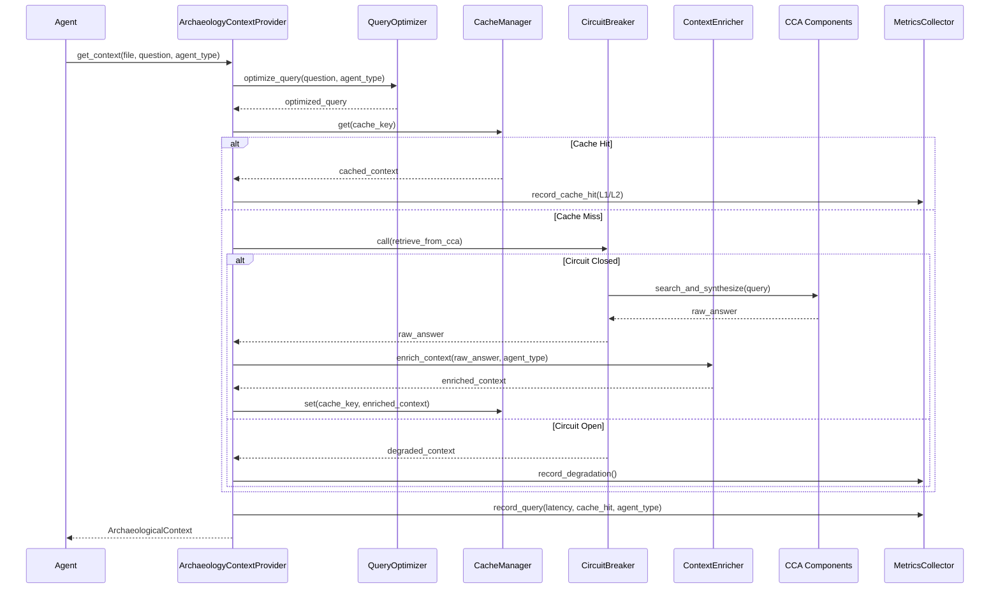
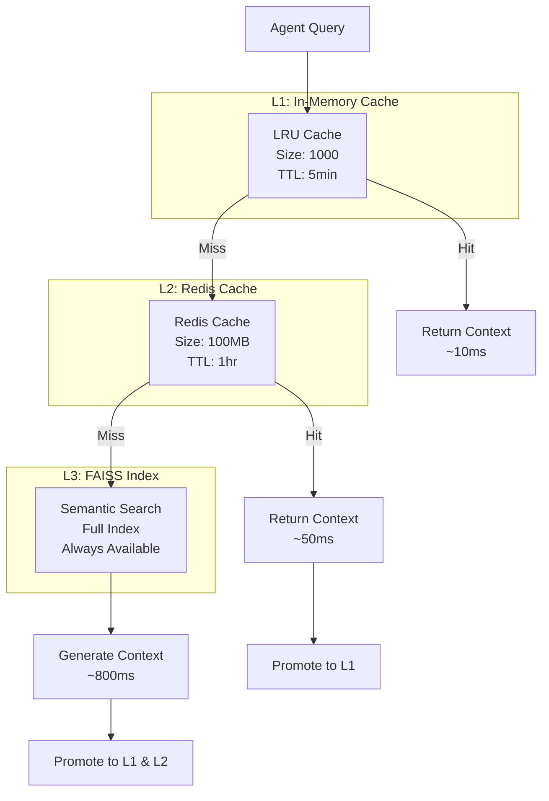
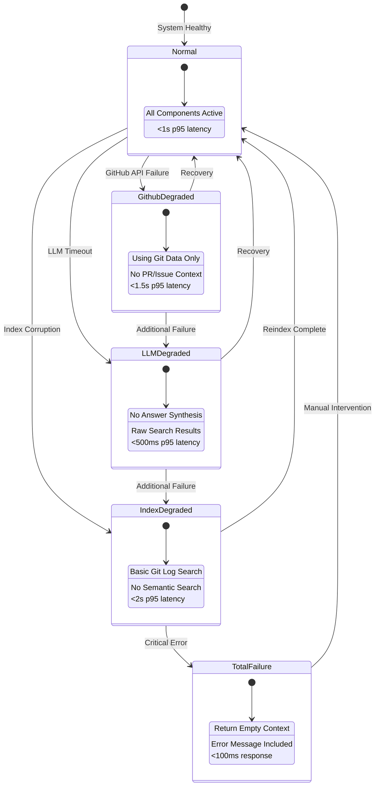
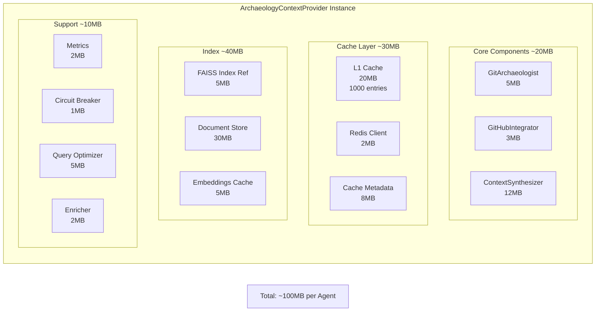
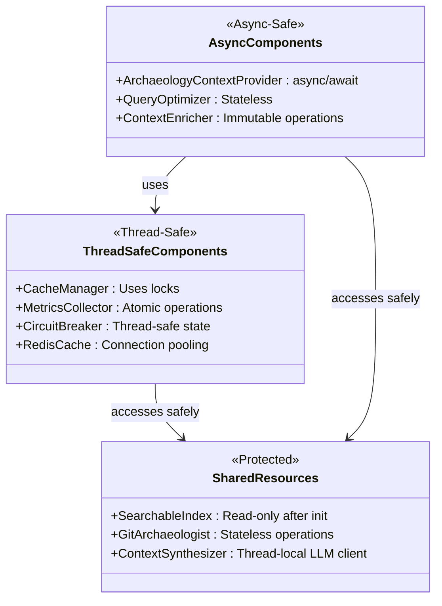

# Archaeological Intelligence Layer - Class Diagram

## Complete System Class Architecture

```mermaid
classDiagram
    %% Main API Interface
    class ArchaeologyContextProvider {
        -repo_path: Path
        -cache_config: CacheConfig
        -performance_config: PerformanceConfig
        -git_archaeologist: GitArchaeologist
        -github_integrator: GitHubArchaeologist
        -context_synthesizer: ContextSynthesizer
        -query_optimizer: QueryOptimizer
        -cache_manager: CacheManager
        -context_enricher: ContextEnricher
        -circuit_breaker: CircuitBreaker
        -metrics_collector: MetricsCollector
        -index: SearchableIndex
        +__init__(repo_path, cache_config, performance_config)
        +get_context(file_path, question, agent_type) ArchaeologicalContext
        +get_context_sync(file_path, question, agent_type) ArchaeologicalContext
        +batch_get_context(requests, agent_type) List~ArchaeologicalContext~
        +warm_cache(patterns) int
        +get_file_history(file_path, limit) List~CommitSummary~
        +search_architectural_decisions(query, limit) List~ArchDecision~
        +get_health_status() Dict
        +shutdown()
        -_initialize_index()
        -_handle_degradation(level, request) ArchaeologicalContext
    }

    %% Data Models
    class ArchaeologicalContext {
        +query: str
        +file_path: str
        +agent_type: str
        +answer: str
        +confidence: float
        +citations: List~Citation~
        +related_commits: List~CommitSummary~
        +architectural_decisions: List~ArchDecision~
        +retrieval_time_ms: float
        +cache_hit: bool
        +degraded_mode: bool
        +agent_hints: Dict
        +suggested_actions: List~str~
        +is_high_confidence() bool
    }

    class Citation {
        +sha: str
        +message: str
        +author: str
        +date: datetime
        +relevance: float
        +url: Optional~str~
    }

    class CommitSummary {
        +sha: str
        +summary: str
        +impact: str
        +files_affected: int
    }

    class ArchDecision {
        +decision: str
        +rationale: str
        +alternatives: List~str~
        +date: datetime
        +commit_sha: str
    }

    %% Configuration
    class CacheConfig {
        +l1_max_size: int
        +l1_ttl_seconds: int
        +l2_enabled: bool
        +l2_host: str
        +l2_port: int
        +l2_db: int
        +l2_ttl_seconds: int
        +l2_max_size_mb: int
        +normalize_queries: bool
        +semantic_clustering: bool
        +warm_on_startup: bool
        +warm_patterns: List~str~
    }

    class PerformanceConfig {
        +max_concurrent_requests: int
        +request_timeout_ms: int
        +circuit_breaker_enabled: bool
        +failure_threshold: int
        +recovery_timeout_seconds: int
        +max_memory_mb: int
        +max_index_size_mb: int
        +enable_degraded_mode: bool
        +degraded_mode_latency_ms: int
        +batch_size: int
        +batch_timeout_ms: int
    }

    %% Core Components
    class QueryOptimizer {
        -query_cache: Dict
        -semantic_model: Any
        +optimize_query(query, agent_type) OptimizedQuery
        +normalize_query(query) str
        +expand_query_semantically(query) List~str~
        +identify_query_pattern(query) QueryPattern
        +route_to_index(query) IndexRoute
        -_load_semantic_model()
    }

    class CacheManager {
        -l1_cache: LRUCache
        -l2_cache: RedisCache
        -cache_config: CacheConfig
        -invalidator: CacheInvalidator
        +get(key) Optional~Any~
        +set(key, value, ttl)
        +delete(key)
        +clear()
        +generate_cache_key(file_path, question, agent_type) str
        +warm_cache(patterns) int
        +get_stats() CacheStats
        -_check_l1(key) Optional~Any~
        -_check_l2(key) Optional~Any~
        -_promote_to_l1(key, value)
    }

    class ContextEnricher {
        -agent_configs: Dict
        -enrichment_rules: List~EnrichmentRule~
        +enrich_context(raw_context, agent_type) ArchaeologicalContext
        +filter_by_relevance(context, agent_type) ArchaeologicalContext
        +add_temporal_context(context) ArchaeologicalContext
        +format_for_agent(context, agent_type) ArchaeologicalContext
        +generate_agent_hints(context, agent_type) Dict
        +suggest_actions(context, agent_type) List~str~
        -_load_agent_configs()
    }

    class CircuitBreaker {
        -state: CircuitState
        -failure_count: int
        -failure_threshold: int
        -recovery_timeout: int
        -last_failure_time: datetime
        -degradation_handler: DegradationHandler
        +call(func, args, kwargs) Any
        +get_state() CircuitState
        +reset()
        +trip()
        -_on_success()
        -_on_failure()
        -_should_attempt_reset() bool
    }

    %% Cache Infrastructure
    class LRUCache {
        -max_size: int
        -ttl_seconds: int
        -cache: OrderedDict
        -timestamps: Dict
        +get(key) Optional~Any~
        +set(key, value)
        +delete(key)
        +clear()
        +size() int
        +evict_expired()
        -_is_expired(key) bool
    }

    class RedisCache {
        -client: Redis
        -ttl_seconds: int
        -max_size_mb: int
        +get(key) Optional~Any~
        +set(key, value)
        +delete(key)
        +delete_pattern(pattern)
        +flushdb()
        +memory_usage() int
        +is_connected() bool
    }

    class CacheInvalidator {
        -l1_cache: LRUCache
        -l2_cache: RedisCache
        +on_commit(commit_sha)
        +on_file_change(file_path)
        +on_reindex()
        +get_affected_files(commit_sha) List~str~
        +invalidate_file_cache(file_path)
    }

    %% Degradation Handling
    class DegradationHandler {
        +handle_degradation(level, request) ArchaeologicalContext
        +git_only_context(request) ArchaeologicalContext
        +raw_search_context(request) ArchaeologicalContext
        +git_log_context(request) ArchaeologicalContext
        +empty_context(message, degraded_mode) ArchaeologicalContext
    }

    class CircuitState {
        <<enumeration>>
        CLOSED
        OPEN
        HALF_OPEN
    }

    class DegradationLevel {
        <<enumeration>>
        NONE
        GITHUB_UNAVAILABLE
        LLM_UNAVAILABLE
        INDEX_CORRUPTED
        TOTAL_FAILURE
    }

    %% Metrics and Monitoring
    class MetricsCollector {
        -query_latency: Histogram
        -cache_hit_rate: Gauge
        -concurrent_requests: Gauge
        -memory_usage: Gauge
        -degradation_events: Counter
        -circuit_breaker_trips: Counter
        +record_query(latency, cache_hit, agent_type)
        +record_cache_hit(cache_level)
        +record_degradation(level)
        +record_error(error_type)
        +get_metrics() Dict
        +export_prometheus() str
    }

    class AILBenchmarkSuite {
        -provider: ArchaeologyContextProvider
        -results: List~BenchmarkResult~
        +run_all_benchmarks()
        +benchmark_single_query_latency()
        +benchmark_cached_query_latency()
        +benchmark_cold_query_latency()
        +benchmark_concurrent_requests()
        +benchmark_batch_processing()
        +benchmark_memory_usage()
        +benchmark_cpu_usage()
        +benchmark_cache_hit_rate()
        +benchmark_degraded_mode()
        +generate_report() BenchmarkReport
    }

    %% Existing CCA Components (simplified)
    class GitArchaeologist {
        +analyze_repo(limit) RepositoryHistory
        +get_file_history(file_path) List~Commit~
        +search_commits(query) List~Commit~
    }

    class GitHubArchaeologist {
        +enrich_history(history) EnrichedHistory
        +get_pull_request(number) PullRequest
        +is_configured() bool
    }

    class ContextSynthesizer {
        +build_searchable_index(enriched) SearchableIndex
        +synthesize_answer(index, question) Answer
        +search_similar(index, query, k) List~Document~
    }

    class SearchableIndex {
        +size: int
        +embeddings: ndarray
        +documents: List~Document~
        +search(query, k) List~Document~
        +add_document(document)
        +save(path)
        +load(path)
    }

    %% Relationships
    ArchaeologyContextProvider --> QueryOptimizer : uses
    ArchaeologyContextProvider --> CacheManager : uses
    ArchaeologyContextProvider --> ContextEnricher : uses
    ArchaeologyContextProvider --> CircuitBreaker : uses
    ArchaeologyContextProvider --> MetricsCollector : uses
    ArchaeologyContextProvider --> GitArchaeologist : wraps
    ArchaeologyContextProvider --> GitHubArchaeologist : wraps
    ArchaeologyContextProvider --> ContextSynthesizer : wraps
    ArchaeologyContextProvider --> SearchableIndex : maintains

    ArchaeologyContextProvider ..> ArchaeologicalContext : creates
    ArchaeologicalContext *-- Citation : contains
    ArchaeologicalContext *-- CommitSummary : contains
    ArchaeologicalContext *-- ArchDecision : contains

    CacheManager --> LRUCache : manages
    CacheManager --> RedisCache : manages
    CacheManager --> CacheInvalidator : uses

    CircuitBreaker --> DegradationHandler : uses
    CircuitBreaker --> CircuitState : tracks
    DegradationHandler --> DegradationLevel : handles

    ArchaeologyContextProvider ..> CacheConfig : configured by
    ArchaeologyContextProvider ..> PerformanceConfig : configured by

    AILBenchmarkSuite --> ArchaeologyContextProvider : benchmarks
```

## Component Interaction Sequence

## Cache Layer Architecture

## Degradation States

## Memory Layout

## Thread Safety Model

## Implementation Priority

1. **Core (Priority 1)**
   - `ArchaeologyContextProvider`
   - `ArchaeologicalContext` data model
   - Basic `CacheManager` (L1 only)

2. **Performance (Priority 2)**
   - `QueryOptimizer`
   - Redis L2 cache
   - `CircuitBreaker`

3. **Enhancement (Priority 3)**
   - `ContextEnricher`
   - `MetricsCollector`
   - Batch processing

4. **Resilience (Priority 4)**
   - `DegradationHandler`
   - `CacheInvalidator`
   - Health monitoring