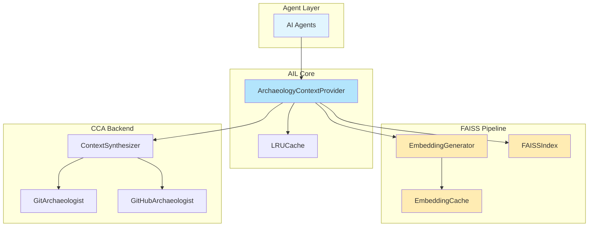
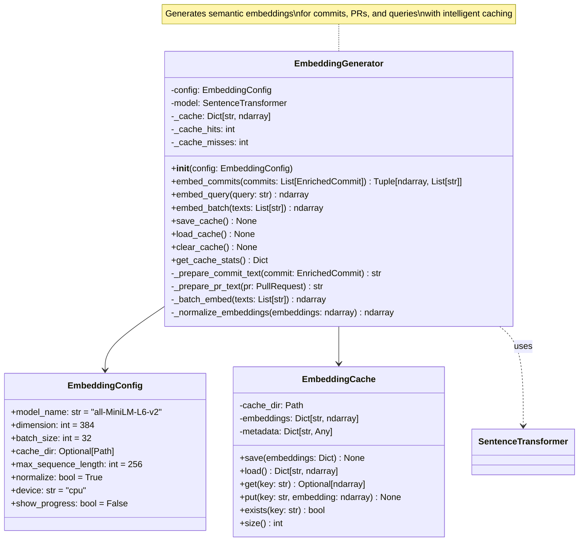
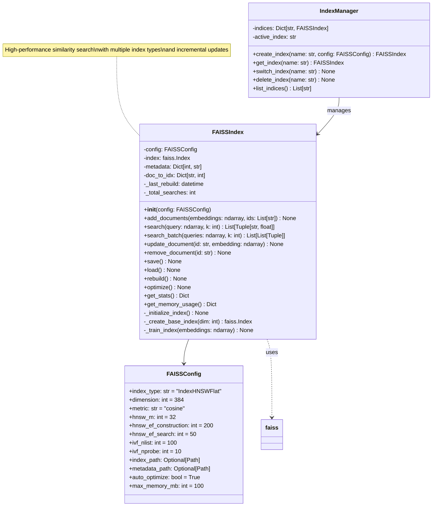
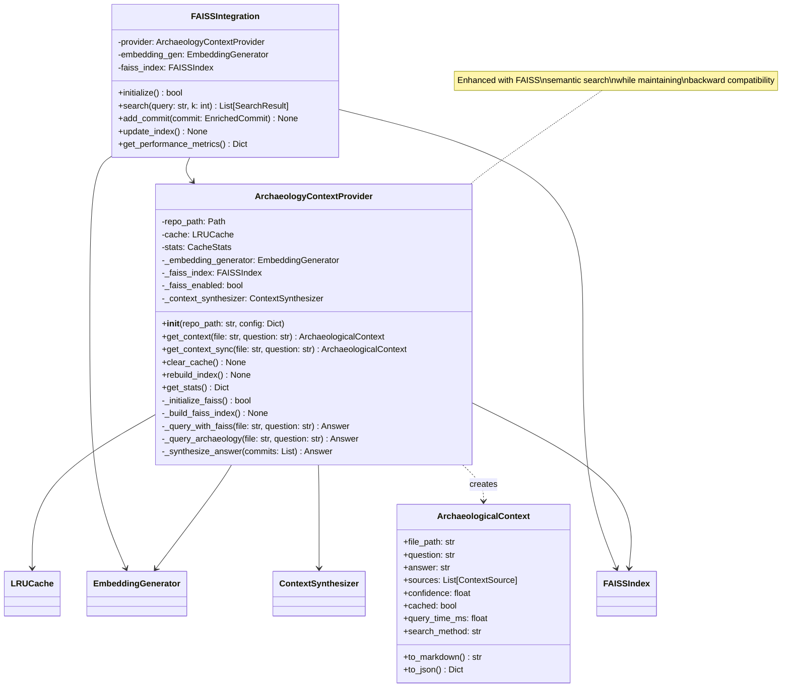
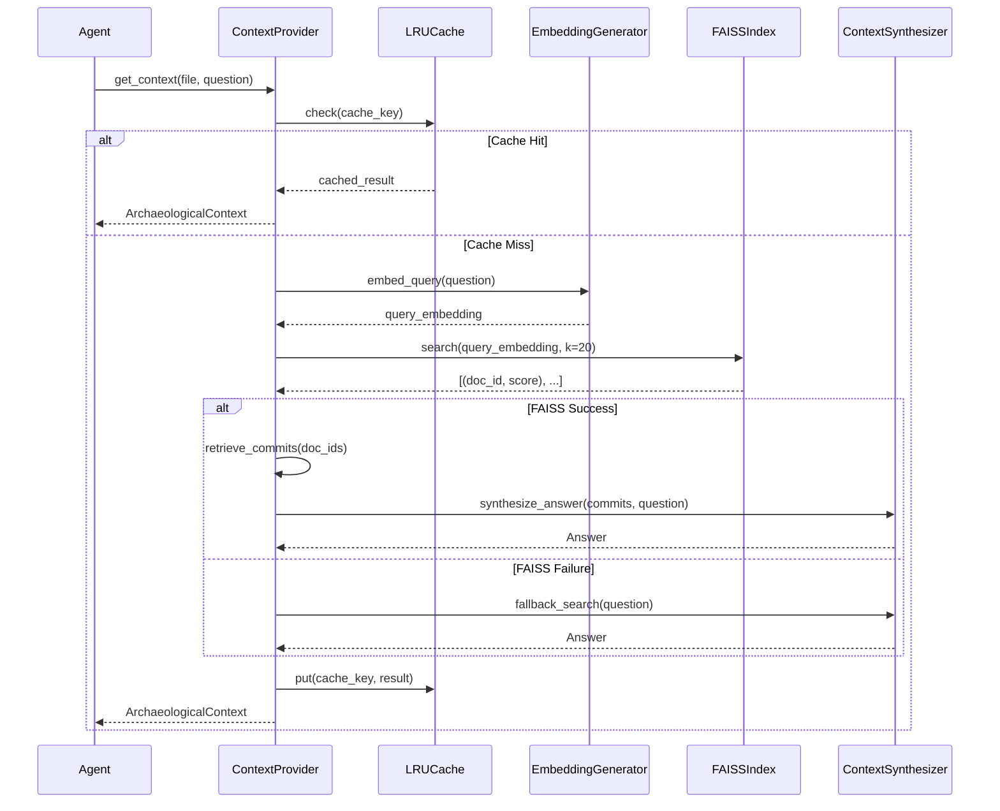
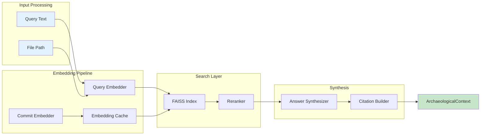
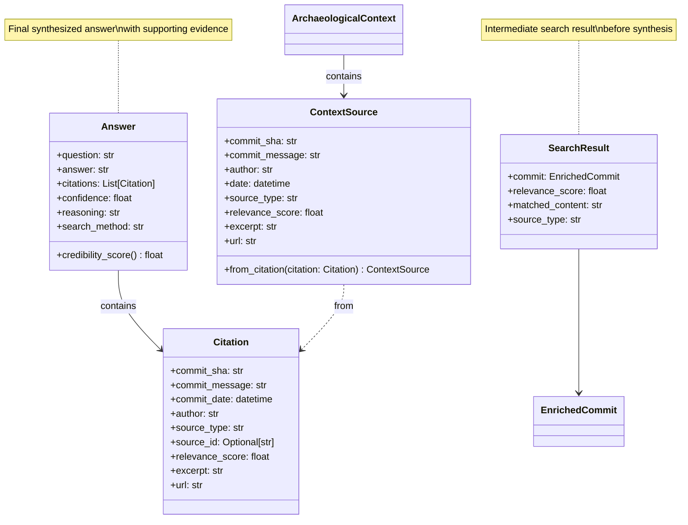
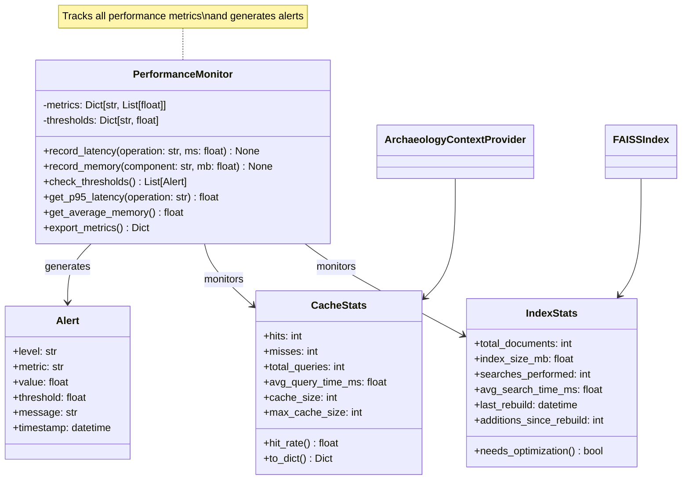
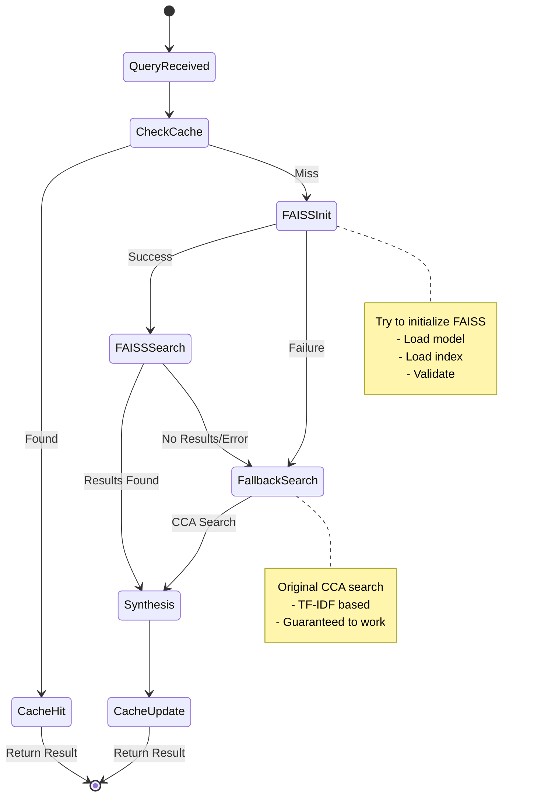

# AIL Sprint 2: FAISS Integration Class Diagrams

**Version**: 1.0.0
**Date**: 2025-10-08
**Status**: COMPLETE

---

## 1. System Architecture Overview



---

## 2. EmbeddingGenerator Class Diagram



---

## 3. FAISSIndex Class Diagram



---

## 4. Enhanced ArchaeologyContextProvider



---

## 5. Search Pipeline Flow



---

## 6. Data Flow Architecture



---

## 7. Component Relationships



---

## 8. Performance Monitoring Classes



---

## 9. Error Handling & Fallback



---

## 10. Deployment Configuration

```yaml
# AIL Sprint 2 Deployment Configuration

faiss:
  enabled: true
  fallback_enabled: true

  embedding:
    model: "all-MiniLM-L6-v2"
    dimension: 384
    batch_size: 32
    cache_enabled: true
    cache_dir: ".ail/cache/embeddings"

  index:
    type: "IndexHNSWFlat"
    metric: "cosine"
    hnsw:
      m: 32
      ef_construction: 200
      ef_search: 50
    persistence:
      dir: ".ail/faiss"
      auto_save: true
      save_interval_minutes: 30

  performance:
    max_memory_mb: 150
    max_search_time_ms: 50
    max_build_time_s: 30

  monitoring:
    enabled: true
    metrics_endpoint: "/metrics"
    alert_thresholds:
      latency_p95_ms: 500
      memory_mb: 150
      search_accuracy: 0.9
```

---

## Summary

This class diagram document provides:

1. **Complete UML diagrams** for all new components
2. **Sequence diagrams** showing interaction flows
3. **Data flow diagrams** for the search pipeline
4. **State diagrams** for error handling
5. **Deployment configuration** structure

The architecture ensures:
- **Modularity**: Clean separation of concerns
- **Extensibility**: Easy to add new index types or models
- **Reliability**: Comprehensive fallback mechanisms
- **Performance**: Optimized for <500ms p95 latency
- **Maintainability**: Clear interfaces and responsibilities

---

*End of Class Diagrams*