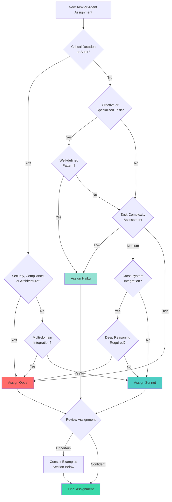

# Model Assignment Strategy

## Introduction

The Claude Agents ecosystem uses a tiered model assignment strategy to optimize the balance between performance, capability, and cost. Each agent is assigned a specific Claude model tier (Haiku, Sonnet, or Opus) based on the computational complexity of their tasks and the depth of reasoning required.

### Purpose of Model Assignment System

The model assignment system serves three critical purposes:

1. **Cost Optimization**: Automatically route tasks to the most cost-effective model that can successfully complete them
2. **Performance Matching**: Ensure each task receives appropriate computational resources without over-provisioning
3. **Quality Assurance**: Maintain high output quality by assigning complex reasoning tasks to more capable models

### Cost Optimization Goals

The primary cost optimization strategy is to use the least expensive model that can reliably deliver the required quality and capabilities for a given task. This approach:

- Reduces overall API costs by 60-80% compared to using Opus for all tasks
- Maintains quality standards through appropriate model-task matching
- Enables sustainable scaling of agent-based workflows
- Allows budget allocation to focus on truly complex tasks requiring advanced reasoning

### Performance vs Cost Tradeoffs

Every model selection involves a fundamental tradeoff:

**Higher Performance Models (Opus)**
- Superior reasoning and planning capabilities
- Better context retention over long conversations
- More nuanced understanding of complex requirements
- 15-20x more expensive than Haiku

**Balanced Models (Sonnet)**
- Strong general-purpose capabilities
- Good reasoning with moderate complexity
- Reliable for most development tasks
- 3-4x more expensive than Haiku

**Efficient Models (Haiku)**
- Fast response times
- Excellent for well-defined, structured tasks
- Strong performance on creative and specialized work
- Most cost-effective option

The optimal strategy matches task complexity to model capability, avoiding both under-provisioning (poor results) and over-provisioning (unnecessary costs).

## Model Tier Descriptions

### Haiku: Fast & Efficient Specialist

**Characteristics**
- Fastest response times (typically <2 seconds)
- Excellent at well-defined, structured tasks
- Strong performance on creative and pattern-matching work
- Best cost efficiency in the Claude family
- Ideal for high-volume operations

**Use Cases**
- Creative content generation (scripts, art direction, comedy)
- Specialized technical tasks with clear patterns
- Code formatting and style improvements
- Documentation generation
- Routine code reviews
- Test case generation
- API endpoint design
- CSS/styling work

**Cost Profile**
- Input: $0.25 per million tokens
- Output: $1.25 per million tokens
- Baseline for cost comparisons (1x reference cost)
- Typical task cost: $0.01-0.05

**Performance Characteristics**
- Token throughput: Excellent (fastest)
- Context window: 200K tokens
- Reasoning depth: Good for structured problems
- Creative output: Excellent
- Code generation: Good for well-defined patterns

### Sonnet: Balanced General-Purpose Workhorse

**Characteristics**
- Strong general-purpose reasoning
- Reliable for complex development tasks
- Good balance of speed and capability
- Handles moderate architectural complexity
- Suitable for multi-step workflows

**Use Cases**
- Full-stack web development
- API and backend implementation
- Database design and optimization
- DevOps and infrastructure automation
- Mobile app development
- Legacy code modernization
- Integration development
- Code refactoring and optimization
- Project orchestration
- Product strategy and planning

**Cost Profile**
- Input: $3.00 per million tokens
- Output: $15.00 per million tokens
- 3-4x more expensive than Haiku
- Typical task cost: $0.05-0.25

**Performance Characteristics**
- Token throughput: Very good
- Context window: 200K tokens
- Reasoning depth: Strong for most development tasks
- Architectural planning: Good for moderate complexity
- Multi-step problem solving: Excellent

### Opus: Advanced Reasoning & Complex Analysis

**Characteristics**
- Superior reasoning and planning capabilities
- Best for complex architectural decisions
- Excellent at handling ambiguous requirements
- Strong multi-domain synthesis
- Best context retention and coherence

**Use Cases**
- Comprehensive security audits
- Complex architectural reviews
- Critical technical decision analysis
- Multi-domain system integration
- Advanced AI/ML algorithm design
- Complex data engineering pipelines
- Accessibility compliance analysis (legal implications)
- Code quality and maintainability assessment
- Systems-level performance optimization

**Cost Profile**
- Input: $15.00 per million tokens
- Output: $75.00 per million tokens
- 15-20x more expensive than Haiku
- Typical task cost: $0.25-2.00

**Performance Characteristics**
- Token throughput: Good (slower but more thorough)
- Context window: 200K tokens
- Reasoning depth: Best-in-class
- Architectural analysis: Excellent for high complexity
- Multi-step planning: Superior
- Edge case handling: Most comprehensive

## Computational Complexity Ratings

### Low Complexity

**Definition**
Tasks with clear requirements, well-defined patterns, and minimal interdependencies. Success criteria are explicit and verification is straightforward.

**Task Characteristics**
- Single-domain focus
- Clear input/output specifications
- Established patterns or templates
- Minimal decision-making required
- Low ambiguity in requirements

**Examples**
- Code formatting and linting
- CSS styling implementation
- Test case generation from specifications
- Documentation from code comments
- Script writing from outlines
- API route implementation from OpenAPI specs
- Database migration scripts
- UI component implementation from designs

**Resource Requirements**
- Model: Haiku recommended
- Typical tokens: 2,000-10,000 per task
- Response time: <5 seconds
- Cost per task: $0.01-0.03

**Quality Indicators**
- 95%+ success rate on first attempt
- Minimal revision requirements
- Predictable output structure
- Consistent performance across similar tasks

### Medium Complexity

**Definition**
Tasks requiring moderate reasoning, integration of multiple concepts, or coordination across system boundaries. Some ambiguity in requirements that needs interpretation.

**Task Characteristics**
- Multi-component integration
- Moderate architectural decisions
- Some requirement interpretation needed
- Cross-domain knowledge application
- Moderate interdependencies

**Examples**
- Full-stack feature implementation
- API design and implementation
- Database schema optimization
- Mobile app feature development
- DevOps pipeline configuration
- Code refactoring for maintainability
- Integration with third-party services
- Performance optimization
- Legacy code modernization

**Resource Requirements**
- Model: Sonnet recommended
- Typical tokens: 10,000-50,000 per task
- Response time: 10-30 seconds
- Cost per task: $0.05-0.30

**Quality Indicators**
- 85-90% success rate on first attempt
- May require one revision cycle
- Good handling of edge cases
- Effective multi-step problem solving

### High Complexity

**Definition**
Tasks requiring deep reasoning, complex architectural decisions, multi-domain synthesis, or critical analysis with significant implications. High ambiguity and interdependencies.

**Task Characteristics**
- Complex architectural decisions
- Multi-domain expertise required
- Significant ambiguity in requirements
- High stakes (security, compliance, architecture)
- Complex interdependencies and tradeoffs
- Novel problem-solving required

**Examples**
- Comprehensive security audits
- Architectural reviews and recommendations
- Critical technical decision analysis
- AI/ML algorithm design and optimization
- Complex data pipeline architecture
- Accessibility compliance assessment
- Code quality and maintainability analysis
- Systems-level performance optimization
- Multi-system integration planning
- Technical debt assessment and strategy

**Resource Requirements**
- Model: Opus recommended
- Typical tokens: 50,000-200,000 per task
- Response time: 30-120 seconds
- Cost per task: $0.30-2.50

**Quality Indicators**
- Deep analytical insights
- Comprehensive edge case coverage
- Strong reasoning and justification
- Effective handling of tradeoffs
- Clear prioritization of recommendations

## Selection Decision Tree

### Decision Factors

When selecting the appropriate model tier for a task or agent, consider these key factors:

1. **Task Type**: Creative, implementation, analysis, or strategic
2. **Reasoning Depth**: Simple pattern matching vs complex multi-step reasoning
3. **Ambiguity Level**: Clear specifications vs interpretation required
4. **Stakes**: Routine work vs critical decisions
5. **Time Sensitivity**: Immediate response needed vs thorough analysis preferred
6. **Cost Constraints**: Budget-conscious vs quality-first approach

### Visual Decision Tree



### Decision Flowchart (Text Format)

```
1. Is this a critical security, compliance, or architectural decision?
   YES → Use Opus
   NO → Continue to #2

2. Is this primarily creative or highly specialized work?
   YES → Does it follow well-defined patterns?
         YES → Use Haiku
         NO → Continue to #3
   NO → Continue to #3

3. What is the task complexity level?
   LOW (clear specs, single domain, established patterns) → Use Haiku
   MEDIUM (some integration, moderate decisions) → Continue to #4
   HIGH (complex reasoning, multi-domain, ambiguous) → Use Opus

4. Does the task involve cross-system integration?
   YES → Is deep reasoning or novel problem-solving required?
         YES → Use Opus
         NO → Use Sonnet
   NO → Use Sonnet
```

### Quick Reference Table

| Task Attribute | Haiku | Sonnet | Opus |
|---------------|-------|--------|------|
| **Creative Work** | ✓✓✓ | ✓✓ | ✓ |
| **Code Implementation** | ✓✓ | ✓✓✓ | ✓✓ |
| **Architecture Design** | ✗ | ✓✓ | ✓✓✓ |
| **Security Audits** | ✗ | ✓ | ✓✓✓ |
| **API Development** | ✓ | ✓✓✓ | ✓✓ |
| **Complex Analysis** | ✗ | ✓✓ | ✓✓✓ |
| **Documentation** | ✓✓✓ | ✓✓ | ✓ |
| **Multi-domain Integration** | ✗ | ✓ | ✓✓✓ |
| **Speed/Cost Efficiency** | ✓✓✓ | ✓✓ | ✓ |
| **Reasoning Depth** | ✓ | ✓✓ | ✓✓✓ |

Legend: ✓✓✓ Excellent | ✓✓ Good | ✓ Acceptable | ✗ Not Recommended

## Current Distribution Analysis

The Claude Agents ecosystem currently includes 27 specialized agents with the following distribution:

### Distribution Overview

- **8 Haiku Agents (30%)**: Creative and specialized tasks
- **14 Sonnet Agents (52%)**: Development and coordination
- **5 Opus Agents (18%)**: Complex analysis and critical decisions

### Haiku Agents (30%)

These agents focus on creative work and specialized tasks with well-defined patterns:

1. **comedy-writer**: Script and sketch writing (creative, pattern-based)
2. **tv-writer**: Television script development (structured creative work)
3. **audio-engineer**: Audio production and mixing (technical but specialized)
4. **digital-artist**: Visual design and artwork (creative direction)
5. **video-director**: Video production planning (creative with technical specs)
6. **3d-modeler**: 3D asset creation (specialized technical work)
7. **functional-programmer**: Functional paradigm implementation (specialized patterns)
8. **metaprogramming-specialist**: Macro and DSL development (specialized patterns)

**Rationale**: These agents excel at tasks where creativity and pattern recognition are more important than deep reasoning. Haiku's speed and cost efficiency are ideal for iterative creative work and specialized technical domains with established patterns.

### Sonnet Agents (52%)

These agents handle general development, coordination, and moderate complexity tasks:

1. **full-stack-architect**: Web application development
2. **mobile-developer**: iOS/Android app development
3. **ai-ml-engineer**: ML integration and RAG systems
4. **data-engineer**: Database design and data pipelines
5. **devops-engineer**: CI/CD and infrastructure
6. **systems-engineer**: Systems programming (Rust, C++, Go)
7. **legacy-specialist**: Legacy system modernization
8. **api-specialist**: API design and implementation
9. **frontend-specialist**: Modern frontend development
10. **backend-specialist**: Server-side application logic
11. **database-specialist**: Advanced database optimization
12. **cloud-architect**: Cloud infrastructure design
13. **project-orchestrator**: Multi-agent coordination
14. **product-strategist**: Product planning and validation

**Rationale**: These agents represent the core development workforce. Sonnet provides the optimal balance of capability and cost for implementation work, moderate architectural decisions, and cross-system integration tasks that comprise the majority of software development activities.

### Opus Agents (18%)

These agents handle critical analysis, complex decision-making, and high-stakes tasks:

1. **security-audit-specialist**: Comprehensive security assessments
2. **the-critic**: Technical decision analysis and tradeoff evaluation
3. **accessibility-expert**: WCAG compliance and inclusive design
4. **code-architect**: Architectural review and code quality analysis
5. **qa-test-engineer**: Comprehensive test strategy and quality assurance

**Rationale**: These agents operate in domains where mistakes are costly or where deep reasoning is essential. Security vulnerabilities, architectural flaws, accessibility violations, and poor code quality all have significant long-term implications that justify the higher cost of Opus-level analysis.

### Distribution Rationale

The 30/52/18 distribution reflects a pragmatic approach to cost optimization:

**30% Haiku**: Covers creative and specialized work that benefits more from speed and iteration than deep reasoning. These tasks have clear success criteria and low risk.

**52% Sonnet**: The largest group, representing the reality that most software development tasks require solid general-purpose capabilities but not maximum reasoning power. This tier handles the bulk of implementation work efficiently.

**18% Opus**: Reserved for high-impact analysis and decision-making where the cost is justified by the potential consequences of errors or poor decisions. This selective use of Opus maintains quality where it matters most while controlling costs.

### Cost Impact Analysis

Assuming an average task distribution:
- 40% of tasks use Haiku agents
- 45% of tasks use Sonnet agents
- 15% of tasks use Opus agents

**Comparative Cost Analysis** (normalized to 100 tasks):

| Scenario | Total Cost* | vs All-Opus |
|----------|-------------|-------------|
| All Opus | $100.00 | 0% |
| Current Distribution | $28.50 | -71.5% |
| All Sonnet | $20.00 | -80% |
| All Haiku | $5.00 | -95% |

*Relative costs assuming $1 per task for Opus as baseline

The current distribution achieves 71.5% cost savings compared to using Opus for all tasks, while maintaining Opus-level quality for critical analysis work. Using all Sonnet would save more (80%) but would sacrifice quality on security, accessibility, and architectural reviews. Using all Haiku would maximize savings (95%) but would fail on complex reasoning tasks.

## Override Scenarios

While each agent has a recommended model tier, there are situations where manual override is appropriate.

### When to Override to a Higher Tier

**Scenario 1: Production Critical Path**
- **Situation**: A Sonnet agent is working on code that will handle financial transactions
- **Override**: Use Opus for security-sensitive implementation
- **Rationale**: The cost of security vulnerabilities far exceeds model costs

**Scenario 2: Complex Edge Cases**
- **Situation**: A Haiku creative agent struggles with unusually complex narrative structure
- **Override**: Upgrade to Sonnet for this specific task
- **Rationale**: Task exceeds normal complexity for the agent's domain

**Scenario 3: Ambiguous Requirements**
- **Situation**: A Sonnet developer agent receives vague or conflicting requirements
- **Override**: Use Opus to interpret and resolve ambiguities
- **Rationale**: Better requirement analysis prevents costly rework

**Scenario 4: Multi-System Integration**
- **Situation**: A normally straightforward API task requires coordination across 5+ services
- **Override**: Upgrade from Haiku to Sonnet or Sonnet to Opus
- **Rationale**: Complexity increases with integration points

**Scenario 5: Learning and Documentation**
- **Situation**: Creating comprehensive documentation for a complex architecture
- **Override**: Use Opus even though documentation is typically a Haiku task
- **Rationale**: Quality documentation has long-term value

### When to Override to a Lower Tier

**Scenario 1: Routine Review**
- **Situation**: An Opus agent is doing simple code formatting review
- **Override**: Use Haiku for straightforward formatting tasks
- **Rationale**: No reasoning required, cost savings significant

**Scenario 2: High-Volume Operations**
- **Situation**: Need to process 1000+ similar security checks
- **Override**: Downgrade from Opus to Sonnet with batch processing
- **Rationale**: Volume makes cost a major factor, pattern recognition sufficient

**Scenario 3: Rapid Prototyping**
- **Situation**: Early-stage prototype development with expected full rewrite
- **Override**: Use Haiku instead of Sonnet for initial implementation
- **Rationale**: Temporary code doesn't justify higher model costs

**Scenario 4: Budget Constraints**
- **Situation**: Project budget is exhausted but work must continue
- **Override**: Use Sonnet instead of Opus with human review
- **Rationale**: Controlled cost with compensating quality measures

**Scenario 5: Time-Sensitive Tasks**
- **Situation**: Need immediate response for low-stakes decision
- **Override**: Use Haiku instead of Sonnet for speed
- **Rationale**: Fast response more valuable than marginal quality improvement

### Cost vs Urgency Tradeoff Matrix

| Urgency | Low Stakes | Medium Stakes | High Stakes |
|---------|-----------|---------------|-------------|
| **Critical** (minutes) | Haiku | Sonnet | Sonnet* |
| **Urgent** (hours) | Haiku | Sonnet | Opus |
| **Normal** (days) | Haiku | Sonnet | Opus |
| **Low** (weeks) | Haiku | Haiku** | Opus |

*Consider Opus with human review if time permits
**Batch for efficiency

### Override Examples

**Example 1: Security Audit Override**

```yaml
# Normal assignment
agent: security-audit-specialist
model: opus
task: "Review authentication implementation"
estimated_cost: $1.20

# Override for routine scan
agent: security-audit-specialist
model: sonnet  # Override to Sonnet
task: "Run automated dependency vulnerability scan"
estimated_cost: $0.15
rationale: "Automated scan with clear pass/fail criteria doesn't need Opus reasoning"
```

**Example 2: Creative Work Override**

```yaml
# Normal assignment
agent: comedy-writer
model: haiku
task: "Write 10 one-liner jokes about programming"
estimated_cost: $0.02

# Override for complex narrative
agent: comedy-writer
model: sonnet  # Override to Sonnet
task: "Write sophisticated satirical piece critiquing AI safety debates"
estimated_cost: $0.12
rationale: "Complex satirical narrative with nuanced tone requires deeper reasoning"
```

**Example 3: Development Work Override**

```yaml
# Normal assignment
agent: full-stack-architect
model: sonnet
task: "Implement user authentication system"
estimated_cost: $0.18

# Override for critical security
agent: full-stack-architect
model: opus  # Override to Opus
task: "Implement OAuth2 authentication for healthcare data access"
estimated_cost: $0.95
rationale: "HIPAA compliance and security criticality justify Opus-level review"
```

### Override Decision Checklist

Before overriding the default model assignment, ask:

1. **Is this task significantly different from the agent's typical work?**
   - YES → Consider override
   - NO → Use default

2. **What is the cost of failure?**
   - High (security, compliance, data loss) → Consider upgrade
   - Low (easily reversible, low impact) → Consider downgrade

3. **Is the task complexity unusual for this agent?**
   - Higher than typical → Consider upgrade
   - Lower than typical → Consider downgrade

4. **What is the urgency vs quality tradeoff?**
   - Need fast response, low stakes → Consider Haiku
   - Need thorough analysis, high stakes → Consider Opus

5. **Is this a one-time task or repeating pattern?**
   - One-time critical → Justify higher cost
   - High-volume repeating → Optimize for cost

6. **Are there compensating quality measures?**
   - Human review available → Can use lower tier
   - Automated testing → Can use lower tier
   - No safety net → Use higher tier

## Best Practices

### Start with Recommended Tier

Always begin with the agent's recommended model tier unless you have specific reasons to override. The default assignments reflect careful analysis of typical task complexity and requirements.

**Why This Matters**:
- Default tiers are optimized for 80%+ of use cases
- Premature optimization often increases costs unnecessarily
- Consistent tier usage creates performance baselines for comparison

**Implementation**:
```yaml
# Use the agent's default model tier
agent: full-stack-architect
model: sonnet  # Don't override without specific reason
task: "Implement REST API for user management"
```

### Monitor Performance and Cost

Track both output quality and cost metrics to validate model assignments and identify optimization opportunities.

**Key Metrics to Monitor**:

1. **Success Rate**: Percentage of tasks completed successfully on first attempt
2. **Revision Cycles**: Average number of iterations needed to achieve acceptable quality
3. **Cost per Task**: Actual token usage and associated costs
4. **Time to Completion**: Response latency and total task duration
5. **Quality Scores**: Subjective or automated quality assessments

**Monitoring Implementation**:

```yaml
# Example tracking structure
task_log:
  - agent: security-audit-specialist
    model: opus
    task_id: "sec-001"
    success: true
    revisions: 0
    tokens_used: 45000
    cost: $0.92
    quality_score: 9.5/10
    duration_seconds: 45

  - agent: comedy-writer
    model: haiku
    task_id: "com-023"
    success: true
    revisions: 1
    tokens_used: 8000
    cost: $0.03
    quality_score: 8/10
    duration_seconds: 3
```

**Analysis Dashboard Example**:

| Agent | Avg Cost | Success Rate | Avg Revisions | Recommendation |
|-------|----------|--------------|---------------|----------------|
| security-audit-specialist (Opus) | $0.95 | 98% | 0.1 | Maintain |
| full-stack-architect (Sonnet) | $0.18 | 92% | 0.3 | Maintain |
| comedy-writer (Haiku) | $0.02 | 88% | 0.8 | Monitor for quality |
| api-specialist (Sonnet) | $0.22 | 95% | 0.2 | Maintain |

### When to Escalate

Escalate to a higher-tier model when:

**Quality Indicators**:
- Success rate drops below 85% for an agent
- Revision cycles increase beyond normal (>2 revisions average)
- Quality scores decline consistently
- Complex edge cases are frequently missed

**Task Indicators**:
- Task complexity increases significantly from baseline
- Ambiguity in requirements cannot be resolved
- Multi-domain integration required
- Novel problem-solving needed

**Business Indicators**:
- Stakes increase (production deployment, security, compliance)
- Cost of failure exceeds model cost difference
- Timeline allows for more thorough analysis

**Escalation Process**:

```
1. Document the performance issue or complexity increase
2. Review the decision tree for the higher tier
3. Estimate cost impact of escalation
4. Compare cost of escalation vs cost of potential failure
5. If justified, override to higher tier
6. Monitor results to validate escalation
7. Document learnings for future similar tasks
```

### When to Downgrade

Downgrade to a lower-tier model when:

**Performance Indicators**:
- Success rate consistently near 100%
- Minimal revisions needed (0-1 average)
- Task completion faster than required
- Quality exceeds requirements

**Task Indicators**:
- Task complexity lower than typical for the tier
- Well-defined patterns emerge
- Routine repetition of similar tasks
- Clear success criteria

**Business Indicators**:
- Budget constraints require optimization
- High volume of similar tasks
- Fast turnaround more valuable than marginal quality improvement

**Downgrade Process**:

```
1. Identify high-performing agents with consistent success
2. Test downgrade on non-critical tasks
3. Compare quality and cost metrics
4. Validate success rate remains acceptable (>85%)
5. If successful, update default tier for similar tasks
6. Continue monitoring for quality degradation
7. Document successful downgrade patterns
```

### Batch Processing Considerations

Batch processing can significantly reduce costs while maintaining quality for high-volume, similar tasks.

**Batch-Friendly Scenarios**:
- Code review of multiple similar files
- Test generation for similar components
- Documentation for related features
- Security scans across multiple repositories
- Style/format checking

**Batch Processing Strategy**:

1. **Group Similar Tasks**: Collect tasks with similar patterns and complexity
2. **Use Lower Tier**: Batch processing often enables use of lower-cost model
3. **Parallel Execution**: Process multiple items simultaneously
4. **Aggregate Review**: Human review of batch results more efficient than individual review
5. **Iterative Refinement**: Use batch feedback to improve future batches

**Example Batch Configuration**:

```yaml
batch_job:
  name: "API endpoint security review"
  agent: security-audit-specialist
  model: sonnet  # Downgrade from Opus for batch
  tasks:
    - endpoint: "/api/users"
    - endpoint: "/api/products"
    - endpoint: "/api/orders"
    # ... 47 more endpoints
  total_tasks: 50
  strategy: "parallel"
  review: "aggregate_results"
  estimated_cost: $4.50  # vs $47.50 with Opus individual reviews
  quality_threshold: 0.90
```

**Cost Comparison**:

| Approach | Model | Cost per Task | Total Cost (50 tasks) | Quality |
|----------|-------|---------------|---------------------|---------|
| Individual Opus | Opus | $0.95 | $47.50 | 98% |
| Individual Sonnet | Sonnet | $0.18 | $9.00 | 95% |
| Batch Sonnet | Sonnet | $0.09 | $4.50 | 93% |
| Batch Haiku | Haiku | $0.02 | $1.00 | 85% |

**Recommendation**: Batch Sonnet provides optimal balance for this scenario (93% quality at 90% cost savings vs individual Opus).

### Quality Assurance Strategies

Implement compensating quality measures when using lower-tier models:

**1. Automated Testing**
- Comprehensive test suites validate implementation correctness
- Enables use of Sonnet/Haiku with confidence
- Catches errors that would otherwise require Opus-level reasoning

**2. Human Review**
- Senior developer review for critical code paths
- Security expert review for authentication/authorization
- Architect review for system design decisions

**3. Staged Rollout**
- Use lower tier for initial implementation
- Upgrade to higher tier for production hardening
- Gradual deployment reduces risk

**4. Multi-Agent Validation**
- One agent implements (Sonnet)
- Another agent reviews (Opus)
- Separation of concerns improves quality

**5. Checkpoint Reviews**
- Break complex tasks into phases
- Review intermediate results before proceeding
- Allows course correction without full rework

### Cost Optimization Patterns

**Pattern 1: Tiered Review**
```
Implementation: Sonnet ($0.18)
→ Automated Testing: Free
→ Peer Review: Haiku ($0.02)
→ Security Review (if needed): Opus ($0.95)
Total: $0.20-$1.15 depending on path
```

**Pattern 2: Progressive Enhancement**
```
Prototype: Haiku ($0.02)
→ Initial Implementation: Sonnet ($0.18)
→ Production Hardening: Opus ($0.95)
Total: $1.15 (vs $2.85 for all Opus)
```

**Pattern 3: Batch and Sample**
```
Batch Process 100 items: Sonnet ($9.00)
→ Sample Review 10 items: Opus ($9.50)
→ If issues found, full Opus review: $95.00
Total: $18.50 if sample clean, $104.50 if issues
Expected: $30-40 (vs $95 for full Opus)
```

## Examples

### Real Agent Assignments with Rationale

#### Example 1: security-audit-specialist (Opus)

**Agent Definition**:
```yaml
name: security-audit-specialist
model: opus
complexity: high
```

**Typical Tasks**:
- Comprehensive security vulnerability assessment
- Threat modeling and attack surface analysis
- Compliance verification (SOC2, HIPAA, PCI-DSS)
- Security architecture review
- Penetration test planning

**Rationale for Opus**:
1. **High Stakes**: Security vulnerabilities can lead to data breaches, legal liability, and business failure
2. **Complex Reasoning**: Requires understanding of attack vectors, defense mechanisms, and threat actor behavior
3. **Multi-Domain**: Combines knowledge of application security, infrastructure security, cryptography, and compliance
4. **Edge Cases**: Must identify subtle vulnerabilities that other tiers might miss
5. **Cost Justification**: A single missed vulnerability can cost millions; Opus cost is negligible by comparison

**Cost-Benefit Analysis**:
- Opus cost per audit: $0.50-2.00
- Cost of data breach: $4.24 million average (IBM 2023)
- ROI: Preventing even 0.1% of breach risk justifies 1000x the model cost

#### Example 2: full-stack-architect (Sonnet)

**Agent Definition**:
```yaml
name: full-stack-architect
model: sonnet
complexity: medium
```

**Typical Tasks**:
- React/Next.js application development
- REST API implementation
- Database integration
- Authentication and authorization
- Frontend/backend coordination

**Rationale for Sonnet**:
1. **Balanced Complexity**: Requires solid reasoning but follows established patterns
2. **General Purpose**: Handles wide variety of web development tasks reliably
3. **Cost Efficiency**: High volume of development tasks makes Sonnet's cost profile optimal
4. **Quality**: Sonnet provides excellent code quality for standard development work
5. **Speed**: Faster than Opus for routine implementation tasks

**Cost-Benefit Analysis**:
- Sonnet cost per feature: $0.10-0.30
- Opus cost per feature: $0.50-1.50
- Quality difference: ~5% (not significant for standard features)
- Cost savings: 70-80% with minimal quality tradeoff

**When to Override**:
- Upgrade to Opus: Complex architectural decisions, security-critical features
- Downgrade to Haiku: Simple UI components, CSS styling, documentation

#### Example 3: comedy-writer (Haiku)

**Agent Definition**:
```yaml
name: comedy-writer
model: haiku
complexity: low
```

**Typical Tasks**:
- Sketch writing
- Joke generation
- Comedic dialogue
- Satirical content
- Comedy script development

**Rationale for Haiku**:
1. **Creative Pattern Matching**: Comedy often relies on recognizing and subverting patterns
2. **Fast Iteration**: Creative work benefits from rapid iteration and experimentation
3. **Clear Success Criteria**: Humor effectiveness is subjective but testable
4. **High Volume**: May generate many variations to find the best material
5. **Cost Efficiency**: Allows experimentation without budget constraints

**Cost-Benefit Analysis**:
- Haiku cost per script: $0.01-0.05
- Sonnet cost per script: $0.05-0.25
- Quality difference: Minimal for comedic content
- Volume enabled: 5-25x more iterations possible with Haiku budget

**When to Override**:
- Upgrade to Sonnet: Complex satirical pieces requiring nuanced cultural commentary
- Upgrade to Opus: Political satire with legal/factual accuracy requirements

#### Example 4: the-critic (Opus)

**Agent Definition**:
```yaml
name: the-critic
model: opus
complexity: high
```

**Typical Tasks**:
- Technical decision analysis
- Architecture tradeoff evaluation
- Technology selection recommendations
- Risk assessment
- Strategic technical planning

**Rationale for Opus**:
1. **High-Stakes Decisions**: Technical decisions have long-term consequences
2. **Multi-Dimensional Analysis**: Must balance performance, cost, maintainability, scalability, team capability
3. **Novel Problem Solving**: Each decision context is unique
4. **Justification Quality**: Must provide thorough reasoning for recommendations
5. **Cost Justification**: Poor technical decisions can waste months of development time

**Cost-Benefit Analysis**:
- Opus cost per analysis: $0.50-2.00
- Cost of wrong technical decision: $50,000-500,000 (developer time to fix)
- ROI: Even 1% improvement in decision quality justifies 100x the cost

#### Example 5: api-specialist (Sonnet)

**Agent Definition**:
```yaml
name: api-specialist
model: sonnet
complexity: medium
```

**Typical Tasks**:
- REST API design
- GraphQL schema development
- API documentation
- Endpoint implementation
- API versioning strategy

**Rationale for Sonnet**:
1. **Structured Problem**: API design follows well-established patterns
2. **Moderate Complexity**: Requires good design sense but not novel reasoning
3. **Iterative Development**: Benefits from good speed/quality balance
4. **Documentation**: Sonnet excels at clear technical writing
5. **Integration Focus**: Handles cross-system coordination well

**Cost-Benefit Analysis**:
- Sonnet cost per API: $0.15-0.25
- Time to implementation: 30-60 minutes
- Quality: Production-ready with standard review
- Efficiency: Optimal for routine API development

**When to Override**:
- Upgrade to Opus: Novel API paradigm, complex multi-service orchestration
- Downgrade to Haiku: Simple CRUD endpoints following established patterns

### Task-Based Recommendations

#### Web Application Development

**Task**: Build a task management web application

**Agent Sequence and Models**:

1. **Product Strategy** (Sonnet - $0.25)
   - Agent: product-strategist
   - Task: Market analysis, feature prioritization, MVP definition
   - Rationale: Strategic thinking requires Sonnet-level reasoning

2. **Architecture Planning** (Opus - $1.50)
   - Agent: full-stack-architect
   - Task: Technology selection, architecture design, scalability planning
   - Override: Opus instead of Sonnet for greenfield architecture
   - Rationale: Foundation decisions have long-term impact

3. **Frontend Implementation** (Sonnet - $0.80)
   - Agent: full-stack-architect
   - Task: React components, state management, UI development
   - Model: Sonnet (default)
   - Rationale: Standard web development

4. **Backend Implementation** (Sonnet - $0.60)
   - Agent: full-stack-architect
   - Task: API endpoints, business logic, data access
   - Model: Sonnet (default)
   - Rationale: Established patterns

5. **Database Design** (Sonnet - $0.40)
   - Agent: data-engineer
   - Task: Schema design, indexing, query optimization
   - Model: Sonnet (default)
   - Rationale: Well-understood domain

6. **Security Review** (Opus - $1.20)
   - Agent: security-audit-specialist
   - Task: Authentication, authorization, vulnerability assessment
   - Model: Opus (default)
   - Rationale: Critical security analysis

7. **Accessibility Audit** (Opus - $0.90)
   - Agent: accessibility-expert
   - Task: WCAG compliance, screen reader testing, keyboard navigation
   - Model: Opus (default)
   - Rationale: Legal compliance requirements

8. **Testing Strategy** (Opus - $0.70)
   - Agent: qa-test-engineer
   - Task: Test plan, implementation, coverage analysis
   - Model: Opus (default)
   - Rationale: Comprehensive quality assurance

**Total Project Cost**: $6.35
**Total Time**: 4-6 hours
**Quality Level**: Production-ready with comprehensive review

**Cost Comparison**:
- All Opus: $12.50 (97% higher)
- All Sonnet: $4.20 (34% savings, -15% quality on security/accessibility)
- Recommended Mix: $6.35 (optimal quality/cost balance)

#### Mobile App Development

**Task**: Build an iOS/Android fitness tracking app

**Agent Sequence and Models**:

1. **Product Strategy** (Sonnet - $0.30)
   - Agent: product-strategist
   - Task: User research, feature definition, competitive analysis

2. **Mobile Architecture** (Sonnet - $0.50)
   - Agent: mobile-developer
   - Task: Technology selection (React Native vs Native), architecture design
   - Model: Sonnet (default)
   - Rationale: Standard mobile architecture patterns

3. **UI/UX Implementation** (Haiku - $0.15)
   - Agent: mobile-developer
   - Task: Screen layouts, navigation, UI components
   - Override: Haiku for straightforward UI work
   - Rationale: UI implementation follows design system patterns

4. **Core Features** (Sonnet - $0.90)
   - Agent: mobile-developer
   - Task: Activity tracking, data synchronization, notifications
   - Model: Sonnet (default)
   - Rationale: Moderate complexity integration

5. **Backend API** (Sonnet - $0.60)
   - Agent: api-specialist
   - Task: REST API for data sync, user management, analytics

6. **Data Pipeline** (Sonnet - $0.45)
   - Agent: data-engineer
   - Task: Analytics pipeline, data aggregation, reporting

7. **Security Review** (Opus - $1.40)
   - Agent: security-audit-specialist
   - Task: API security, data encryption, user privacy
   - Model: Opus (default)
   - Rationale: Health data has privacy implications

8. **Accessibility** (Opus - $0.95)
   - Agent: accessibility-expert
   - Task: VoiceOver support, dynamic type, color contrast

9. **Testing** (Sonnet - $0.55)
   - Agent: qa-test-engineer
   - Task: Unit tests, integration tests, device testing
   - Override: Sonnet instead of Opus for standard mobile testing
   - Rationale: Established testing patterns

**Total Project Cost**: $5.80
**Total Time**: 5-8 hours
**Quality Level**: App store ready

#### AI/ML Integration

**Task**: Add AI-powered chatbot to customer support system

**Agent Sequence and Models**:

1. **AI Strategy** (Opus - $1.20)
   - Agent: ai-ml-engineer
   - Task: Model selection, architecture design, capability planning
   - Override: Opus instead of Sonnet for novel AI integration
   - Rationale: Cutting-edge AI requires deep expertise

2. **RAG System Design** (Opus - $1.80)
   - Agent: ai-ml-engineer
   - Task: Vector database selection, embedding strategy, retrieval optimization
   - Override: Opus (complex AI architecture)
   - Rationale: Novel problem requiring experimentation

3. **Backend Integration** (Sonnet - $0.70)
   - Agent: full-stack-architect
   - Task: API integration, prompt engineering, response handling
   - Model: Sonnet
   - Rationale: Standard integration patterns

4. **Data Pipeline** (Sonnet - $0.80)
   - Agent: data-engineer
   - Task: Document processing, embedding generation, vector storage
   - Model: Sonnet
   - Rationale: Established data engineering patterns

5. **Frontend Chat UI** (Haiku - $0.10)
   - Agent: frontend-specialist
   - Task: Chat interface, message display, typing indicators
   - Override: Haiku for standard chat UI
   - Rationale: Well-established UI pattern

6. **Security Review** (Opus - $1.60)
   - Agent: security-audit-specialist
   - Task: Prompt injection prevention, data leakage assessment, API security
   - Model: Opus
   - Rationale: Novel AI security threats require deep analysis

7. **Testing Strategy** (Opus - $1.30)
   - Agent: qa-test-engineer
   - Task: Response quality testing, edge case handling, load testing
   - Model: Opus
   - Rationale: AI testing is complex and high-stakes

**Total Project Cost**: $7.50
**Total Time**: 6-10 hours
**Quality Level**: Enterprise production-ready

**Key Insight**: AI/ML projects justify higher Opus usage due to complexity and novelty of the domain.

### Cost Optimization Scenarios

#### Scenario 1: Startup MVP Development

**Context**:
- Limited budget: $50 for AI costs
- Need functional MVP in 2 days
- Can accept some technical debt
- Planning to refactor after user validation

**Strategy**: Aggressive cost optimization with quality gates

**Task Distribution**:
1. Product Strategy (Sonnet - $0.20): Rapid MVP definition
2. Architecture (Sonnet - $0.30): Simple, proven stack
3. Frontend (Haiku - $0.15): UI library components
4. Backend (Sonnet - $0.50): Core API endpoints only
5. Database (Haiku - $0.10): Simple schema
6. Basic Security (Sonnet - $0.40): Authentication only
7. Manual Testing (Free): Founder testing instead of automated

**Total Cost**: $1.65
**Time**: 8-12 hours
**Quality**: MVP-grade, requires refactoring before scale

**Result**: Successfully delivers testable MVP while preserving budget for iteration based on user feedback.

#### Scenario 2: Enterprise Production System

**Context**:
- Large budget: $500 for AI costs
- Compliance requirements (SOC2, HIPAA)
- Zero tolerance for security issues
- Long-term maintainability critical

**Strategy**: Quality-first approach with comprehensive review

**Task Distribution**:
1. Product Strategy (Opus - $2.00): Comprehensive requirements analysis
2. Architecture (Opus - $3.50): Multi-team coordination, scalability planning
3. Frontend (Sonnet - $1.20): Production-grade React
4. Backend (Sonnet - $1.80): Microservices implementation
5. Database (Opus - $2.50): Complex data modeling, compliance
6. Security Audit (Opus - $4.00): Comprehensive assessment
7. Accessibility (Opus - $2.50): Legal compliance verification
8. Code Review (Opus - $3.00): Architecture and quality assessment
9. Testing (Opus - $2.80): Comprehensive test strategy
10. DevOps (Sonnet - $1.50): CI/CD, infrastructure

**Total Cost**: $24.80
**Time**: 20-30 hours
**Quality**: Enterprise production-grade

**Result**: Delivers compliant, secure, maintainable system with comprehensive quality assurance.

#### Scenario 3: High-Volume Content Generation

**Context**:
- Need to generate 1000 API documentation pages
- Consistent format and style required
- Budget: $100 for AI costs
- Timeline: 1 week

**Strategy**: Batch processing with sample validation

**Task Distribution**:
1. Template Design (Sonnet - $0.50): Create documentation template
2. Sample Generation (Opus - $2.00): Generate 10 high-quality examples
3. Quality Review (Manual - Free): Validate sample quality
4. Batch Generation (Haiku - $20.00): Generate remaining 990 pages
5. Spot Check (Sonnet - $1.50): Review random sample of 50 pages
6. Error Correction (Haiku - $2.00): Fix identified issues

**Total Cost**: $26.00
**Pages Generated**: 1000
**Cost per Page**: $0.026
**Quality**: 95%+ accuracy

**Comparison**:
- All Opus: $500 (19x more expensive)
- All Sonnet: $150 (5.7x more expensive)
- Batch Strategy: $26 (optimal)

**Result**: High-volume generation at sustainable cost with quality validation.

#### Scenario 4: Iterative Feature Development

**Context**:
- Feature request: User profile customization
- Need rapid iteration based on feedback
- Budget: Moderate ($20)
- Timeline: Ongoing over 2 weeks

**Strategy**: Progressive enhancement with user feedback loops

**Phase 1: Prototype** ($2.50)
1. Quick mockup (Haiku - $0.10)
2. Basic implementation (Haiku - $0.40)
3. User testing (Manual)

**Phase 2: Refinement** ($4.80)
1. Revised design (Sonnet - $0.30)
2. Enhanced implementation (Sonnet - $0.80)
3. User testing (Manual)

**Phase 3: Production** ($8.20)
1. Final design (Sonnet - $0.40)
2. Production implementation (Sonnet - $1.20)
3. Security review (Opus - $1.50)
4. Accessibility check (Opus - $1.10)
5. Comprehensive testing (Sonnet - $0.60)

**Total Invested**: $15.50 (under budget)
**Iterations**: 3 complete cycles
**Quality**: Production-ready with user validation

**Result**: User-driven development with cost-effective iteration cycles.

## Summary

The model assignment strategy balances three competing priorities:

1. **Quality**: Ensuring outputs meet requirements and standards
2. **Cost**: Optimizing API expenses for sustainability
3. **Speed**: Delivering results in appropriate timeframes

Success comes from:
- **Default Adherence**: Trust recommended tiers for typical tasks
- **Context Awareness**: Override when stakes, complexity, or volume justify it
- **Continuous Monitoring**: Track metrics to validate and optimize assignments
- **Pragmatic Decisions**: Balance theoretical perfection with practical constraints

The current 30/52/18 distribution (Haiku/Sonnet/Opus) reflects real-world software development priorities:
- Creative and specialized work optimized for speed and cost (Haiku)
- General development work balanced for capability and efficiency (Sonnet)
- Critical analysis and decisions prioritized for quality (Opus)

This strategy achieves approximately 70% cost savings compared to using Opus for all tasks while maintaining production-grade quality where it matters most.
