# ClaudeAgents User's Guide
## Mastering Claude Code 2.0 with Specialized AI Agents

*Your comprehensive guide to leveraging the power of 28+ specialized AI agents for professional software development*

---

## Table of Contents

1. [Introduction](#introduction)
2. [Getting Started](#getting-started)
3. [The Agent Ecosystem](#the-agent-ecosystem)
4. [Agent Selection Guide](#agent-selection-guide)
5. [Common Workflows](#common-workflows)
6. [Multi-Agent Orchestration](#multi-agent-orchestration)
7. [Command System](#command-system)
8. [Best Practices](#best-practices)
9. [Common Pitfalls](#common-pitfalls)
10. [Advanced Techniques](#advanced-techniques)
11. [Troubleshooting](#troubleshooting)
12. [Reference](#reference)

---

## Introduction

### What is ClaudeAgents?

ClaudeAgents is a comprehensive ecosystem of specialized AI agents designed to work with Claude Code 2.0. Each agent is an expert in their domain, capable of delivering production-ready solutions individually or in coordinated teams.

Think of ClaudeAgents as your personal software development team, where each member is a world-class specialist ready to tackle specific challenges. Whether you're building a web app, securing your infrastructure, or creating multimedia content, there's an agent (or team of agents) optimized for your task.

### System Philosophy

The ClaudeAgents system is built on three core principles:

1. **Truth Over Theater**: Real functionality, not demonstrations
2. **Reality-First Development**: Connect to actual systems from day one
3. **Professional Accountability**: Honest reporting and verifiable results

Every agent in the ecosystem adheres to [The Manifesto](manifesto.md) - professional standards that ensure you get production-ready solutions, not proof-of-concept mockups.

### How to Use This Guide

This guide is designed for progressive learning:

- **Beginners**: Start with [Getting Started](#getting-started) and [Agent Selection Guide](#agent-selection-guide)
- **Intermediate Users**: Focus on [Common Workflows](#common-workflows) and [Multi-Agent Orchestration](#multi-agent-orchestration)
- **Advanced Users**: Explore [Advanced Techniques](#advanced-techniques) and [Best Practices](#best-practices)

Each section includes visual diagrams, practical examples, and real-world scenarios to accelerate your learning.

---

## Getting Started

### Prerequisites

To use ClaudeAgents effectively, you need:

1. **Claude Code 2.0**: Access to claude.ai/code
2. **Basic Understanding**: Familiarity with your project domain (web dev, mobile, etc.)
3. **Clear Goals**: Well-defined problems you want to solve

No installation is required - agents are loaded automatically when you work with this repository.

### Your First Agent Interaction

The simplest way to start is with a direct agent request:

```
Use full-stack-architect to create a task management app with React and Node.js
```

Claude Code will:
1. Load the `full-stack-architect` agent
2. Apply its specialized knowledge and workflows
3. Deliver a complete implementation following professional standards

### Understanding Agent Responses

Agents provide:

- **Technical Implementation**: Working code, not pseudocode
- **Real Integration**: Actual database connections, API calls
- **Professional Documentation**: Architecture decisions, setup guides
- **Verification Steps**: How to test that everything works

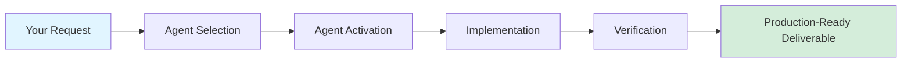

### Quick Start Examples

#### Example 1: Web Application
```
Use full-stack-architect to build a blog with Next.js 15, PostgreSQL, and user authentication
```

#### Example 2: Security Review
```
Have security-audit-specialist review my authentication implementation in src/auth/
```

#### Example 3: AI Feature
```
Get ai-ml-engineer to add semantic search to my documentation using RAG
```

#### Example 4: Mobile App
```
Use mobile-developer to create an iOS app for fitness tracking with HealthKit integration
```

---

## The Agent Ecosystem

### Overview

The ClaudeAgents ecosystem consists of 28 specialized agents organized into six categories:

```mermaid
graph TD
    ROOT[ClaudeAgents Ecosystem]

    ROOT --> STRATEGY[Strategy & Planning]
    ROOT --> DEV[Core Development]
    ROOT --> AI[AI & Machine Learning]
    ROOT --> QUALITY[Quality & Security]
    ROOT --> CREATIVE[Creative & Specialized]
    ROOT --> DECISION[Decision Support]

    STRATEGY --> S1[product-strategist]
    STRATEGY --> S2[project-orchestrator]

    DEV --> D1[full-stack-architect]
    DEV --> D2[mobile-developer]
    DEV --> D3[data-engineer]
    DEV --> D4[devops-engineer]

    AI --> A1[ai-ml-engineer]
    AI --> A2[systems-engineer]
    AI --> A3[metaprogramming-specialist]

    QUALITY --> Q1[security-audit-specialist]
    QUALITY --> Q2[qa-test-engineer]
    QUALITY --> Q3[accessibility-expert]
    QUALITY --> Q4[code-architect]

    CREATIVE --> C1[digital-artist]
    CREATIVE --> C2[video-director]
    CREATIVE --> C3[audio-engineer]
    CREATIVE --> C4[3d-modeler]
    CREATIVE --> C5[comedy-writer]
    CREATIVE --> C6[tv-writer]

    DECISION --> DC1[the-critic]
    DECISION --> DC2[creative-catalyst]

    style ROOT fill:#4a90e2
    style STRATEGY fill:#f39c12
    style DEV fill:#27ae60
    style AI fill:#8e44ad
    style QUALITY fill:#e74c3c
    style CREATIVE fill:#ff69b4
    style DECISION fill:#95a5a6
```

### Agent Categories

#### 1. Strategy & Planning
**When to use**: Starting new projects, complex multi-domain initiatives

- **product-strategist**: Market research, competitive analysis, product ideation
- **project-orchestrator**: Complex project coordination, multi-agent workflows

#### 2. Core Development
**When to use**: Building software applications across different platforms

- **full-stack-architect**: Web applications (React, Next.js, Node.js, APIs)
- **mobile-developer**: iOS/Android apps (Swift, Kotlin, React Native, Flutter)
- **data-engineer**: Databases, data pipelines, analytics, ML infrastructure
- **devops-engineer**: CI/CD, Docker, Kubernetes, cloud deployment

#### 3. AI & Machine Learning
**When to use**: Adding intelligence, high-performance systems, code generation

- **ai-ml-engineer**: LLM integration, RAG systems, vector databases
- **systems-engineer**: Rust, C++, Go, performance-critical systems
- **metaprogramming-specialist**: Lisp, macros, DSLs, code generation

#### 4. Quality & Security
**When to use**: Ensuring production readiness, compliance, reliability

- **security-audit-specialist**: Vulnerability assessment, compliance (SOC2, GDPR)
- **qa-test-engineer**: Testing strategies, test automation, quality assurance
- **accessibility-expert**: WCAG compliance, inclusive design, screen readers
- **code-architect**: Architecture review, code quality, technical debt

#### 5. Creative & Specialized
**When to use**: Multimedia content, game development, creative projects

- **digital-artist**: UI/UX graphics, game assets (pixel art, sprites)
- **video-director**: Video production, editing, post-production
- **audio-engineer**: Audio production, Logic Pro, music composition
- **3d-modeler**: 3D assets, Blender workflows, game development
- **comedy-writer**: Creative writing, humor, narrative structures
- **tv-writer**: Television scripts, procedural dramas, character development

#### 6. Decision Support
**When to use**: Evaluating technical options, brainstorming solutions

- **the-critic**: Technical decision analysis, architectural critique
- **creative-catalyst**: Creative problem-solving, lateral thinking

#### 7. Specialized Tools
**When to use**: Niche technical challenges

- **functional-programmer**: Haskell, Clojure, F#, type systems
- **legacy-specialist**: Legacy code migration, compatibility layers
- **platform-integrator**: Native platform APIs (macOS, Windows, Linux)
- **elisp-specialist**: Emacs configuration, package development
- **linux-sysadmin**: Server administration, Linux troubleshooting, systemd
- **merge-conflict-resolver**: Git conflicts, complex merges, code integration

---

## Agent Selection Guide

### Decision Tree

Use this decision tree to quickly identify the right agent for your needs:

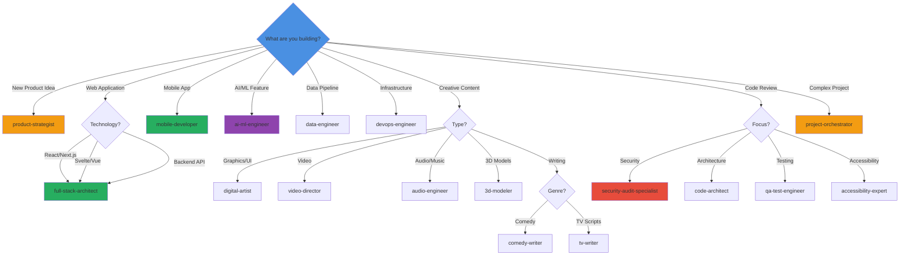

### Keyword-Based Selection

Quick reference for agent selection based on keywords in your request:

| Keywords | Primary Agent | Supporting Agents |
|----------|---------------|-------------------|
| React, Next.js, web app, API | `full-stack-architect` | `accessibility-expert`, `qa-test-engineer` |
| iOS, Android, Swift, Kotlin, mobile | `mobile-developer` | `qa-test-engineer`, `accessibility-expert` |
| AI, LLM, RAG, embeddings, ML | `ai-ml-engineer` | `data-engineer`, `systems-engineer` |
| database, SQL, PostgreSQL, data pipeline | `data-engineer` | `devops-engineer` |
| Docker, Kubernetes, CI/CD, deploy | `devops-engineer` | `security-audit-specialist` |
| security audit, vulnerability, compliance | `security-audit-specialist` | `code-architect` |
| test, QA, testing strategy | `qa-test-engineer` | - |
| accessibility, WCAG, screen reader | `accessibility-expert` | `full-stack-architect` |
| pixel art, sprites, UI graphics | `digital-artist` | - |
| video, editing, post-production | `video-director` | `audio-engineer` |
| audio, music, Logic Pro | `audio-engineer` | - |
| 3D, Blender, models, game assets | `3d-modeler` | `digital-artist` |
| Rust, C++, performance, systems | `systems-engineer` | - |
| Haskell, Clojure, functional | `functional-programmer` | - |
| Lisp, macros, DSL | `metaprogramming-specialist` | - |
| legacy code, migration | `legacy-specialist` | `code-architect` |
| Linux, server, systemd, troubleshooting | `linux-sysadmin` | `devops-engineer` |
| market research, competitive analysis | `product-strategist` | - |
| complex project, multi-team | `project-orchestrator` | (coordinates all) |
| technical decision, evaluate options | `the-critic` | - |

### Complexity-Based Selection

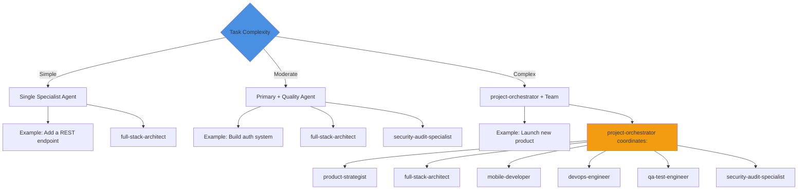

### When to Use project-orchestrator

Use `project-orchestrator` when your project involves:

- **Multiple domains**: Web + Mobile + Infrastructure
- **Complex dependencies**: Components that must integrate in specific order
- **Quality gates**: Security, testing, accessibility checks required
- **Large scope**: More than 3 specialist agents needed
- **Unclear requirements**: Need help breaking down the work

Example:
```
Use project-orchestrator to plan and build a SaaS product for team collaboration with:
- Web app (React)
- Mobile apps (iOS and Android)
- Real-time sync
- User authentication
- File storage
- Payment integration
```

---

## Common Workflows

### Workflow 1: Building a Web Application

**Scenario**: Create a full-stack web application from scratch

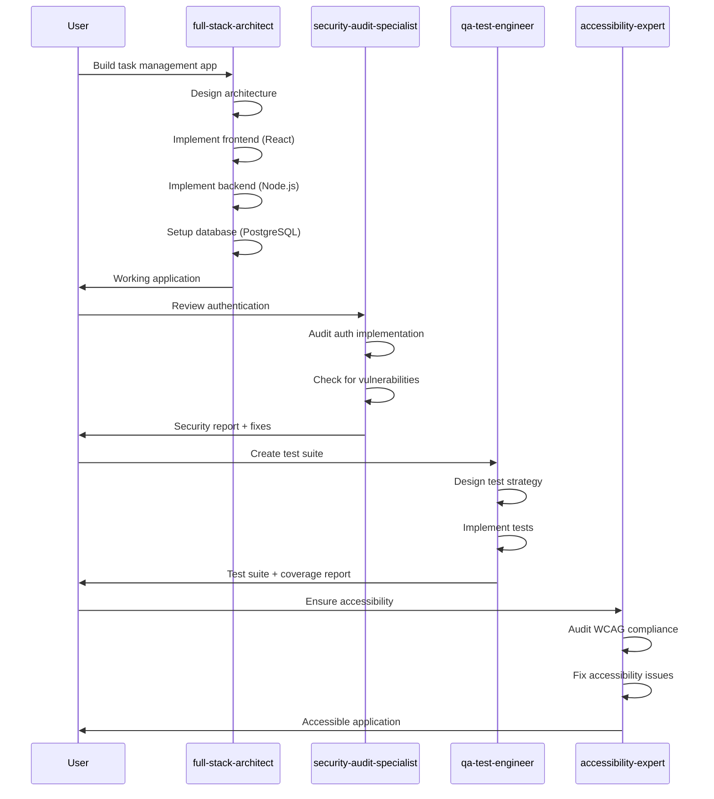

**Step-by-Step**:

1. **Initial Development**
   ```
   Use full-stack-architect to create a task management app with:
   - Next.js 15 with App Router
   - PostgreSQL database
   - User authentication
   - Real-time updates
   ```

2. **Security Review**
   ```
   Have security-audit-specialist review the authentication system
   and identify any vulnerabilities
   ```

3. **Testing**
   ```
   Get qa-test-engineer to create a comprehensive test suite with
   unit, integration, and E2E tests
   ```

4. **Accessibility**
   ```
   Use accessibility-expert to ensure WCAG 2.1 AA compliance
   ```

### Workflow 2: Adding AI Features

**Scenario**: Integrate semantic search into an existing application


**Request**:
```
Use ai-ml-engineer to add semantic search to my documentation site.
Current stack: Next.js, PostgreSQL
Requirements:
- Search across 500+ markdown docs
- Natural language queries
- Sub-second response time
```

**What you get**:
- Vector database setup (Pinecone or pgvector)
- Embedding generation pipeline
- RAG implementation with LangChain
- Search API endpoints
- Frontend integration guide

### Workflow 3: Mobile App Development

**Scenario**: Create a cross-platform mobile app

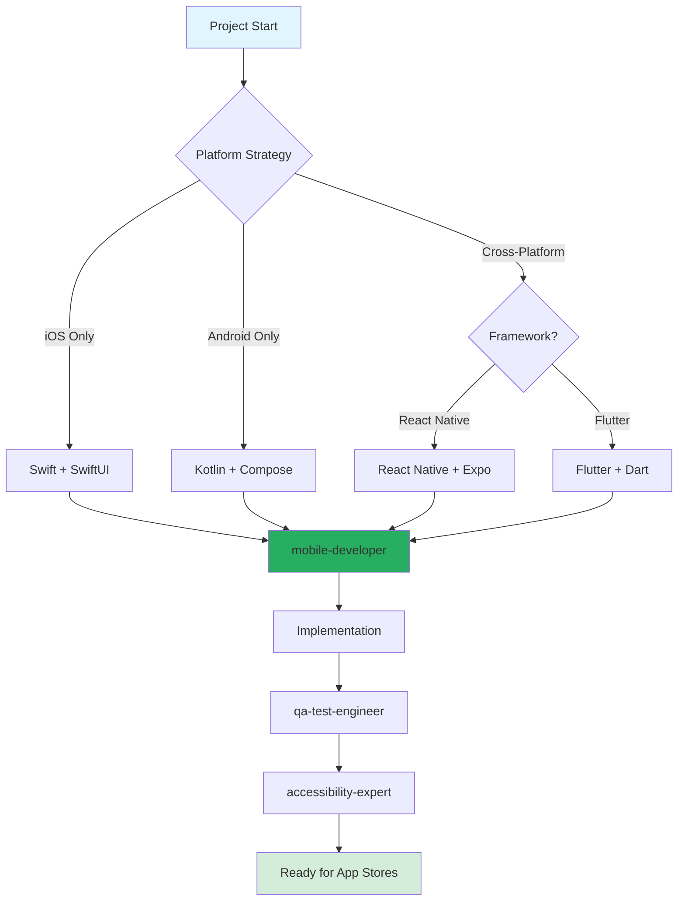

**Request**:
```
Use mobile-developer to create a fitness tracking app with:
- Cross-platform (iOS + Android)
- HealthKit/Google Fit integration
- Workout logging
- Progress charts
- Social features
```

### Workflow 4: Infrastructure & Deployment

**Scenario**: Set up production infrastructure for a new application

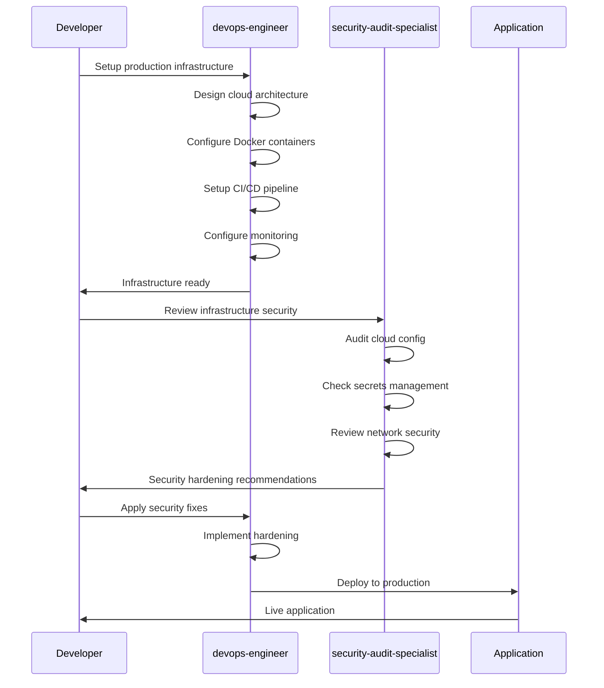

**Request**:
```
Use devops-engineer to set up production infrastructure for my Next.js app:
- Docker containerization
- Kubernetes deployment
- PostgreSQL database
- Redis caching
- CI/CD with GitHub Actions
- Monitoring and logging
```

### Workflow 5: Legacy Code Modernization

**Scenario**: Migrate legacy codebase to modern stack

```mermaid
graph LR
    A[Legacy App] --> B[legacy-specialist]
    B --> C[Analyze Codebase]
    C --> D[Create Migration Plan]
    D --> E[code-architect]
    E --> F[Design New Architecture]
    F --> G[full-stack-architect]
    G --> H[Implement Migration]
    H --> I[qa-test-engineer]
    I --> J[Verify Functionality]
    J --> K[Modern App]

    style A fill:#ffe6e6
    style K fill:#d4edda
```

**Request**:
```
Use legacy-specialist to analyze my jQuery/PHP app and create a migration
plan to React/Node.js while maintaining all existing functionality
```

### Workflow 6: Creative Project

**Scenario**: Create game assets and multimedia content

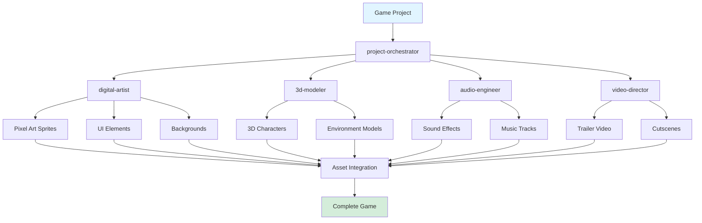

**Request**:
```
Use project-orchestrator to coordinate creating assets for a retro platformer:
- Pixel art character sprites with animations
- 8 background scenes
- UI elements (health bar, menus)
- Chiptune music (3 tracks)
- Sound effects (20 effects)
- Gameplay trailer video
```

---

## Multi-Agent Orchestration

### Understanding Orchestration

Multi-agent orchestration is the process of coordinating multiple specialist agents to work on different aspects of a complex project simultaneously or sequentially.

### Orchestration Patterns

#### Pattern 1: Sequential Handoff

Best for: Projects where each phase depends on the previous one

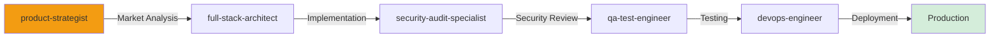

**Example**:
```
Use project-orchestrator to:
1. Have product-strategist validate the market opportunity
2. Get full-stack-architect to build the MVP
3. Have security-audit-specialist review security
4. Get qa-test-engineer to create test suite
5. Use devops-engineer to deploy to production
```

#### Pattern 2: Parallel Execution

Best for: Independent work streams that can progress simultaneously

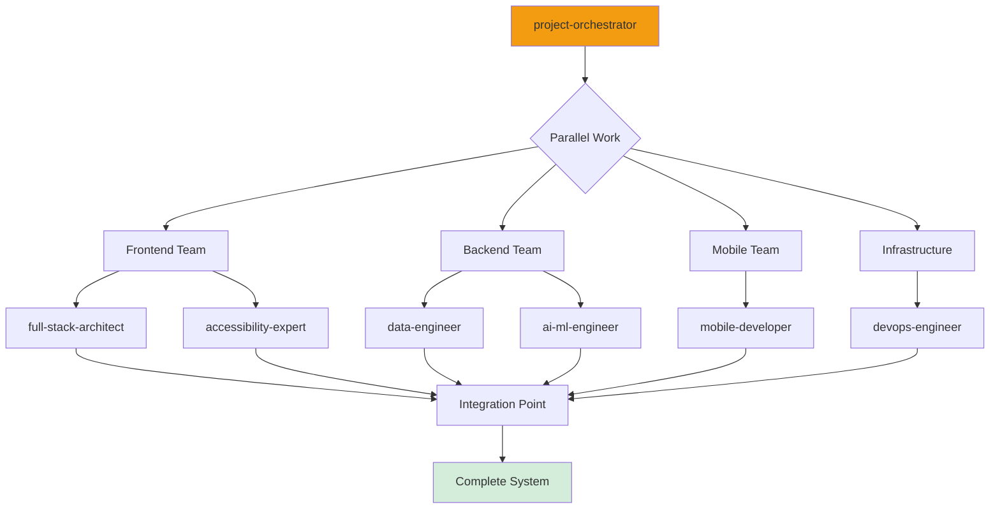

**Example**:
```
Use project-orchestrator to coordinate parallel development:
- full-stack-architect: Build web frontend
- data-engineer: Design and implement database schema
- mobile-developer: Create mobile apps
- devops-engineer: Set up infrastructure
All teams work simultaneously, integrate at the end
```

#### Pattern 3: Iterative Refinement

Best for: Creative projects requiring review and revision cycles

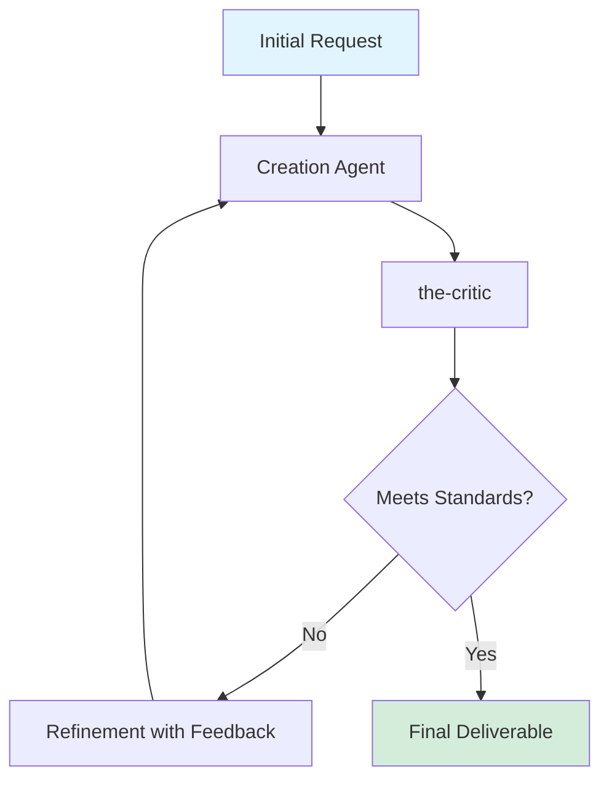

**Example**:
```
Iterative design process:
1. digital-artist creates initial UI mockups
2. the-critic reviews design decisions
3. digital-artist refines based on feedback
4. Repeat until design meets standards
```

#### Pattern 4: Quality Gates

Best for: Production deployments requiring multiple quality checks

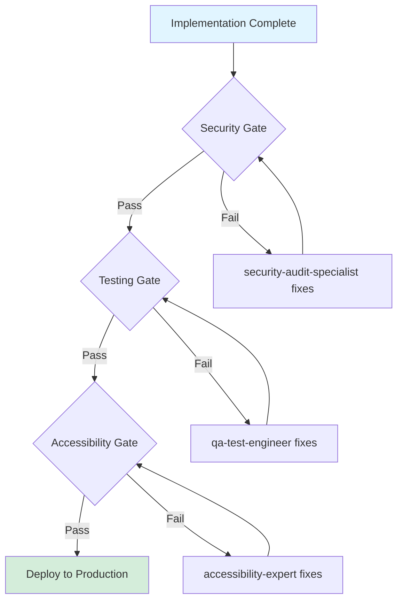

**Example**:
```
Production deployment checklist:
1. security-audit-specialist: No critical vulnerabilities
2. qa-test-engineer: 90%+ test coverage, all tests pass
3. accessibility-expert: WCAG 2.1 AA compliance
4. devops-engineer: Deploy only after all gates pass
```

### Orchestration Best Practices

1. **Clear Deliverables**: Define exactly what each agent should produce
2. **Integration Points**: Specify how agent outputs connect
3. **Quality Criteria**: Set measurable success standards
4. **Dependency Management**: Ensure prerequisites are met before handoffs
5. **Communication Protocol**: Use structured formats for agent-to-agent updates

### Example: Complete Product Launch

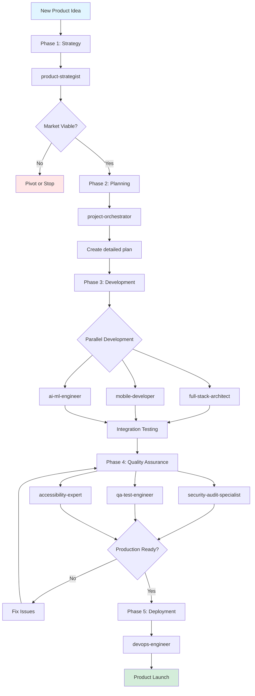

**Full Request**:
```
Use project-orchestrator to launch a new SaaS product:

Phase 1 - Strategy (1 week):
- product-strategist: Market research, competitive analysis, validation

Phase 2 - Planning (1 week):
- project-orchestrator: Architecture, timeline, resource allocation

Phase 3 - Development (4 weeks):
- full-stack-architect: Web application (React + Node.js)
- mobile-developer: iOS and Android apps
- ai-ml-engineer: AI-powered features
- data-engineer: Analytics pipeline

Phase 4 - Quality Assurance (1 week):
- security-audit-specialist: Security audit
- qa-test-engineer: Test suite creation
- accessibility-expert: WCAG compliance

Phase 5 - Deployment (1 week):
- devops-engineer: Production infrastructure
- devops-engineer: CI/CD pipeline
- devops-engineer: Monitoring setup

Total: 8 weeks to launch
```

---

## Command System

The ClaudeAgents system includes pre-built commands that orchestrate multiple agents for common workflows.

### Available Commands

#### Development Commands

Located in `commands/development/`:

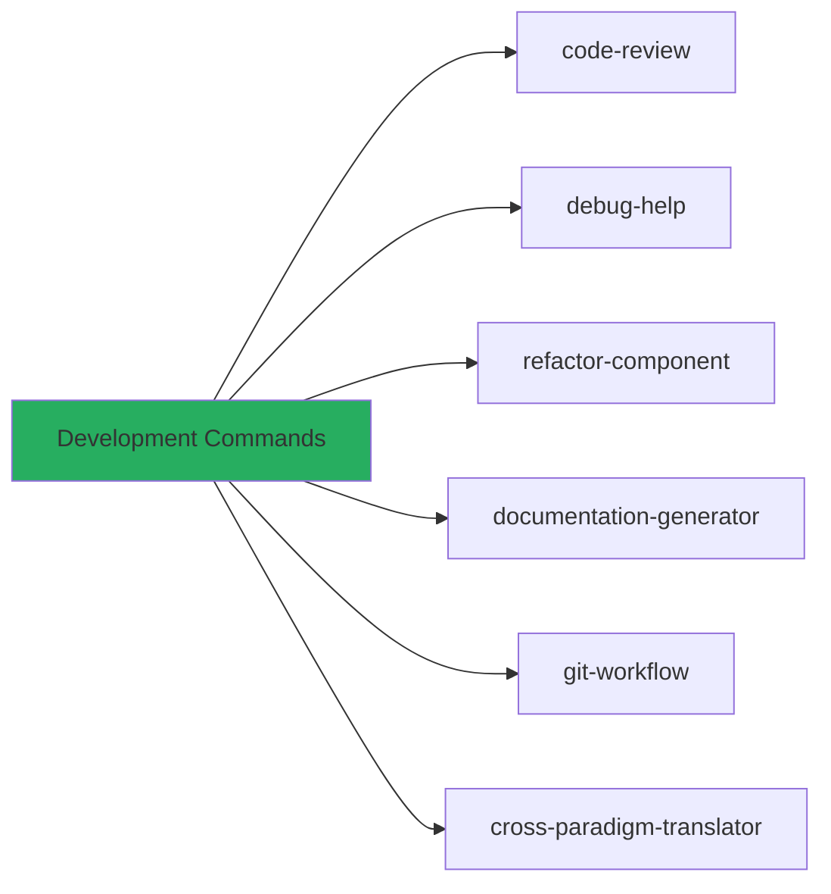

**code-review**: Comprehensive code quality review
```
Use /code-review on src/components/ to identify improvements
```

**debug-help**: Debugging assistance with systematic approach
```
Use /debug-help for the authentication timeout issue
```

**refactor-component**: Code refactoring with modern patterns
```
Use /refactor-component on src/legacy/UserManager.js
```

**documentation-generator**: Auto-generate documentation
```
Use /documentation-generator for the API endpoints
```

**git-workflow**: Git operations and best practices
```
Use /git-workflow to set up feature branch workflow
```

**cross-paradigm-translator**: Translate code between languages/paradigms
```
Use /cross-paradigm-translator to convert Python script to Rust
```

#### Quality Commands

Located in `commands/quality/`:

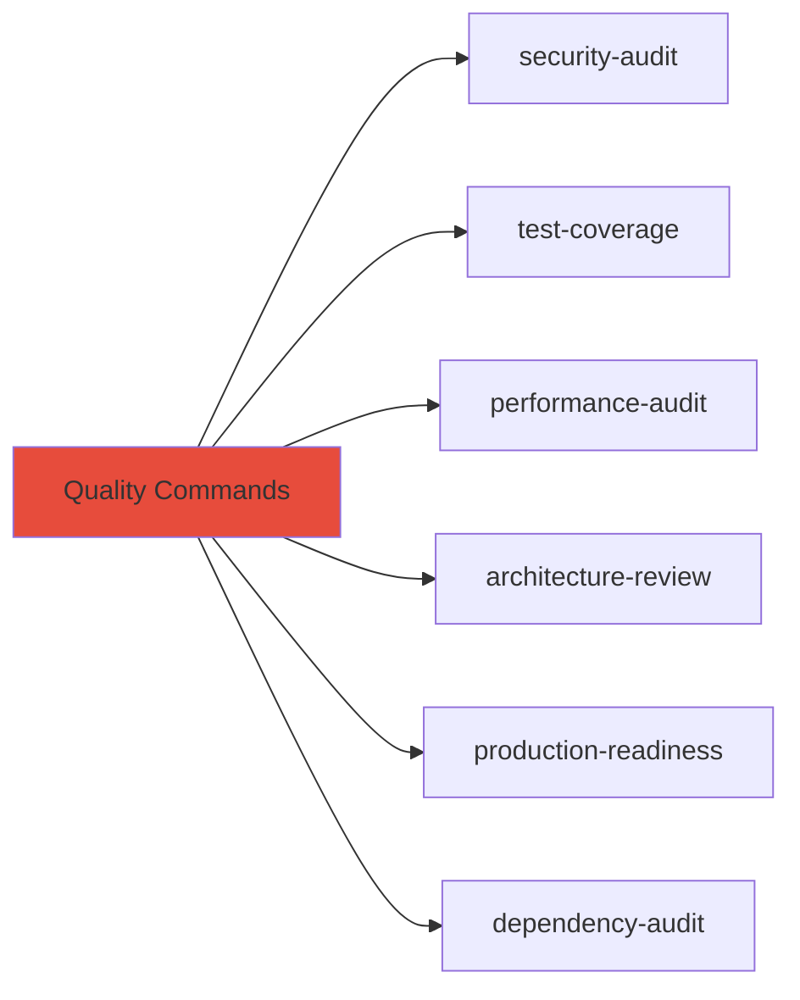

**security-audit**: Comprehensive security vulnerability scan
```
Use /security-audit to check for vulnerabilities in authentication system
```

**test-coverage**: Test implementation and coverage analysis
```
Use /test-coverage to create test suite for src/api/
```

**performance-audit**: Performance optimization review
```
Use /performance-audit to identify bottlenecks in the app
```

**architecture-review**: System architecture assessment
```
Use /architecture-review to evaluate current architecture and suggest improvements
```

**production-readiness**: Pre-deployment checklist
```
Use /production-readiness to verify app is ready for launch
```

**dependency-audit**: Security check for dependencies
```
Use /dependency-audit to scan for vulnerable packages
```

#### Deployment Commands

Located in `commands/deployment/`:

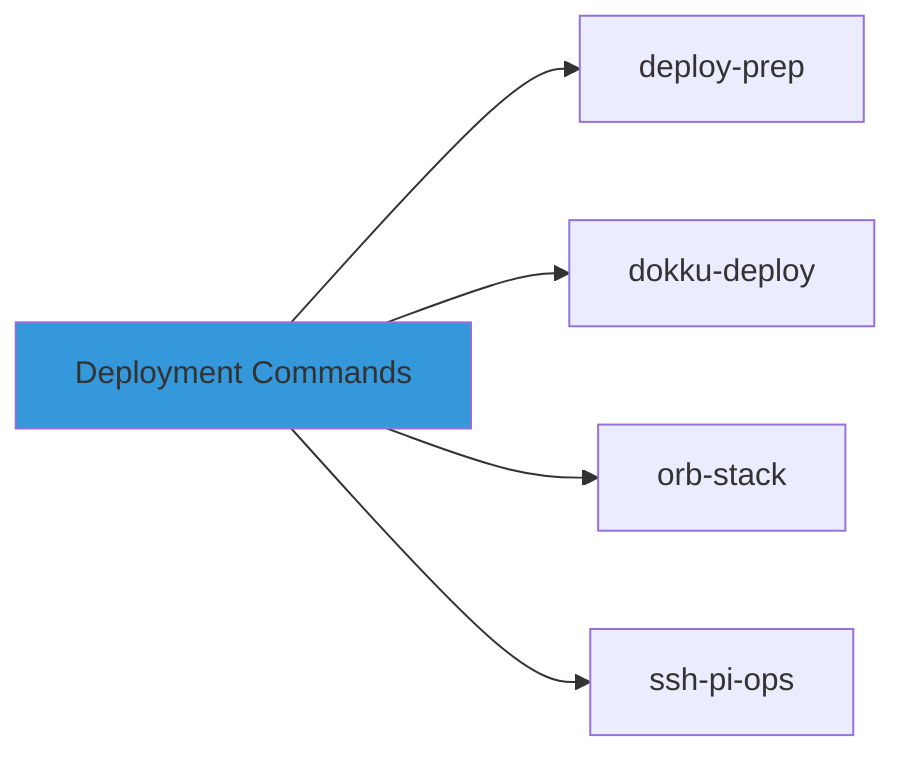

**deploy-prep**: Deployment preparation and checklist
```
Use /deploy-prep to prepare app for production deployment
```

**dokku-deploy**: Dokku PaaS deployment
```
Use /dokku-deploy to set up Dokku deployment
```

**orb-stack**: OrbStack container configuration
```
Use /orb-stack to configure local development environment
```

**ssh-pi-ops**: Raspberry Pi operations and deployment
```
Use /ssh-pi-ops to deploy to Raspberry Pi server
```

#### Specialized Commands

Located in `commands/specialized/`:

**Python Tools**:
- `uv-workflow`: Modern Python with uv package manager
- `modern-stack`: Latest Python stack (FastAPI, Pydantic, etc.)
- `data-pipeline`: Data processing pipelines
- `web-api`: FastAPI web services
- `scraping`: Web scraping with Beautiful Soup/Scrapy

**Other Languages**:
- `rust-cargo`: Rust development with Cargo
- `xcode-power-tools`: iOS development with Xcode
- `safari-web-extension`: Safari browser extensions
- `lisp-macro-workshop`: Lisp macro programming
- `roswell`: Common Lisp development setup

#### Workflow Commands

Located in `commands/workflows/`:

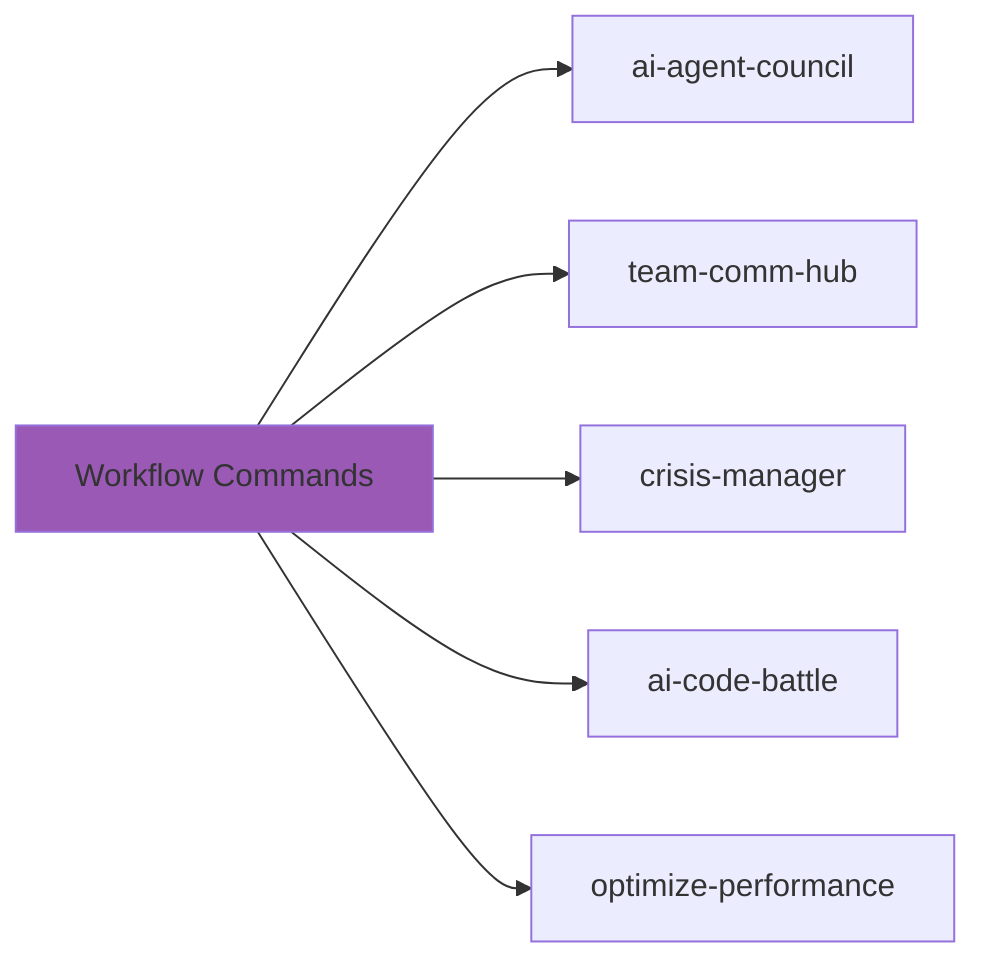

**ai-agent-council**: Multi-agent collaborative decision making
```
Use /ai-agent-council to evaluate database technology options
```

**team-comm-hub**: Team communication optimization
```
Use /team-comm-hub to set up team collaboration tools
```

**crisis-manager**: Emergency response and incident management
```
Use /crisis-manager for production outage response
```

**ai-code-battle**: Compare multiple implementation approaches
```
Use /ai-code-battle to compare REST vs GraphQL for this API
```

**optimize-performance**: Multi-agent performance tuning
```
Use /optimize-performance to improve application speed
```

### Creating Custom Commands

You can create custom commands by adding markdown files to the appropriate subdirectory in `commands/`:

```markdown
---
name: my-custom-workflow
description: "Custom workflow for my specific needs"
---

# My Custom Workflow

## Phase 1: Analysis
Use code-architect to analyze the current codebase structure.

## Phase 2: Implementation
Use full-stack-architect to implement the new feature.

## Phase 3: Testing
Use qa-test-engineer to create comprehensive tests.

## Phase 4: Security Review
Use security-audit-specialist to review for vulnerabilities.
```

---

## Best Practices

### 1. Start with the Right Agent

**DO**:
```
Use full-stack-architect to build a blog with Next.js
```

**DON'T**:
```
Build me a blog
(Claude will use default mode, not the specialized agent)
```

### 2. Provide Context and Constraints

**DO**:
```
Use full-stack-architect to build an e-commerce site with:
- Next.js 15 with App Router
- Stripe payment integration
- PostgreSQL with Prisma
- Admin dashboard
- Must support 10,000+ products
```

**DON'T**:
```
Use full-stack-architect to build an e-commerce site
(Too vague, missing important requirements)
```

### 3. Specify Real Integration Requirements

**DO**:
```
Use ai-ml-engineer to add semantic search to my docs.
Connect to my existing PostgreSQL database at 'postgresql://localhost/docs'
Store embeddings in pgvector extension
```

**DON'T**:
```
Use ai-ml-engineer to add semantic search
(Agent will make assumptions about your infrastructure)
```

### 4. Request Quality Gates for Production Code

**DO**:
```
Use full-stack-architect to build authentication system, then:
- security-audit-specialist to review for vulnerabilities
- qa-test-engineer to create test suite
- accessibility-expert to ensure WCAG compliance
```

**DON'T**:
```
Use full-stack-architect to build authentication system
(No quality checks, risky for production)
```

### 5. Use project-orchestrator for Complex Projects

**DO**:
```
Use project-orchestrator to coordinate building a SaaS product with
web app, mobile apps, and infrastructure
```

**DON'T**:
```
Use full-stack-architect to build web app
Use mobile-developer to build mobile apps
Use devops-engineer to set up infrastructure
(Manual coordination is error-prone)
```

### 6. Be Specific About Technology Choices

**DO**:
```
Use mobile-developer to create iOS app with:
- SwiftUI for UI
- Core Data for persistence
- Combine for reactive programming
- HealthKit integration
```

**DON'T**:
```
Use mobile-developer to create iOS app
(Agent may choose different technologies than you expect)
```

### 7. Request Verification and Testing

**DO**:
```
Use full-stack-architect to build API, then verify:
- All endpoints respond correctly
- Database operations work
- Authentication is functional
- Error handling is robust
```

**DON'T**:
```
Use full-stack-architect to build API
(No verification requested, may have untested code)
```

### 8. Iterate with Feedback

**DO**:
```
Use digital-artist to create character sprite.
[Review result]
The character looks great, but make the eyes larger and add a shadow.
```

**DON'T**:
```
Use digital-artist to create character sprite.
[Accept first result without review]
```

### 9. Document Architecture Decisions

**DO**:
```
Use code-architect to design the system, including:
- Architecture Decision Records (ADRs)
- Component diagrams
- Data flow documentation
- API contracts
```

**DON'T**:
```
Use full-stack-architect to build the system
(No documentation of why decisions were made)
```

### 10. Plan for Maintenance

**DO**:
```
Use devops-engineer to set up infrastructure with:
- Automated backups
- Monitoring and alerting
- Log aggregation
- Incident response playbook
```

**DON'T**:
```
Use devops-engineer to deploy the app
(No plan for ongoing operations)
```

---

## Common Pitfalls

### Pitfall 1: Using Wrong Agent for Task

**Problem**: Asking an agent to work outside their expertise

**Example**:
```
Use digital-artist to implement the database schema
```

**Solution**: Use the correct specialist
```
Use data-engineer to design and implement the database schema
```

**Why it matters**: Each agent is optimized for specific domains. Using the wrong agent leads to suboptimal solutions.

---

### Pitfall 2: Skipping Quality Agents

**Problem**: Deploying to production without security, testing, or accessibility review

**Example**:
```
Use full-stack-architect to build auth system
[Deploy to production immediately]
```

**Solution**: Include quality gates
```
Use full-stack-architect to build auth system
Use security-audit-specialist to review for vulnerabilities
Use qa-test-engineer to create test suite
Use accessibility-expert to ensure WCAG compliance
```

**Why it matters**: Quality issues found in production are 10-100x more expensive to fix.

---

### Pitfall 3: Vague Requirements

**Problem**: Not providing enough context or constraints

**Example**:
```
Use full-stack-architect to build a website
```

**Solution**: Provide detailed requirements
```
Use full-stack-architect to build a portfolio website with:
- Next.js 15 with App Router
- Blog with MDX support
- Project showcase gallery
- Contact form with email notifications
- Dark mode toggle
- Responsive design
- SEO optimization
```

**Why it matters**: Vague requirements lead to agents making assumptions that may not match your needs.

---

### Pitfall 4: Not Verifying Real Integration

**Problem**: Accepting mock implementations instead of real connections

**Example**:
```
"I've created a mock database connection..."
[Accepting this as complete]
```

**Solution**: Request real integration
```
Connect to the actual PostgreSQL database at postgresql://localhost/mydb
Show me the working connection and a test query
```

**Why it matters**: Mock systems don't reveal integration issues until it's too late.

---

### Pitfall 5: Ignoring Agent Handoffs

**Problem**: Not managing dependencies between agents

**Example**:
```
Use mobile-developer to build app
Use devops-engineer to deploy backend
[Both work simultaneously without coordination]
```

**Solution**: Use orchestrator or explicit sequencing
```
Use project-orchestrator to:
1. data-engineer: Design and implement API
2. mobile-developer: Build app using that API
3. devops-engineer: Deploy both together
```

**Why it matters**: Parallel work without coordination leads to integration failures.

---

### Pitfall 6: Overlooking Performance

**Problem**: Building systems without performance considerations

**Example**:
```
Use full-stack-architect to build social media feed
[No mention of performance requirements]
```

**Solution**: Specify performance requirements
```
Use full-stack-architect to build social media feed with:
- Must load 100 posts in <500ms
- Infinite scroll with pagination
- Image optimization and lazy loading
- Database query optimization
- Caching strategy for frequently accessed data
```

**Why it matters**: Performance issues are hard to retrofit; must be designed in from the start.

---

### Pitfall 7: No Error Handling Strategy

**Problem**: Not planning for failure scenarios

**Example**:
```
Use full-stack-architect to build payment processing
[No mention of error handling]
```

**Solution**: Specify error handling requirements
```
Use full-stack-architect to build payment processing with:
- Retry logic for failed payments
- Error logging and alerting
- User-friendly error messages
- Idempotency for duplicate requests
- Transaction rollback on failures
```

**Why it matters**: Production systems must gracefully handle failures.

---

### Pitfall 8: Monolithic Agent Requests

**Problem**: Asking one agent to do too much

**Example**:
```
Use full-stack-architect to build the entire SaaS product including
web app, mobile apps, infrastructure, security, testing, and deployment
```

**Solution**: Break into specialist tasks
```
Use project-orchestrator to coordinate:
- full-stack-architect: Web application
- mobile-developer: Mobile apps
- devops-engineer: Infrastructure
- security-audit-specialist: Security review
- qa-test-engineer: Testing
```

**Why it matters**: Complex projects need multiple specialists for optimal results.

---

### Pitfall 9: Ignoring Accessibility

**Problem**: Not considering accessibility until the end

**Example**:
```
Use full-stack-architect to build user interface
[After completion] Make it accessible
```

**Solution**: Include accessibility from the start
```
Use full-stack-architect and accessibility-expert to build accessible
user interface with WCAG 2.1 AA compliance from the beginning
```

**Why it matters**: Retrofitting accessibility is much harder than building it in.

---

### Pitfall 10: No Documentation Plan

**Problem**: Building systems without documentation

**Example**:
```
Use full-stack-architect to build complex API
[No documentation requested]
```

**Solution**: Request documentation as a deliverable
```
Use full-stack-architect to build API with:
- OpenAPI/Swagger documentation
- Integration guide for clients
- Code examples for common use cases
- Architecture decision records
- Deployment guide
```

**Why it matters**: Undocumented systems are expensive to maintain and onboard new developers.

---

## Advanced Techniques

### Technique 1: Agent Chaining with State

Create complex workflows where each agent builds on the previous agent's output:

```
Use product-strategist to analyze the market for project management tools.
Save the findings.

Use code-architect to design an architecture based on the market analysis.
Document key decisions.

Use full-stack-architect to implement the design with Next.js and PostgreSQL.

Use security-audit-specialist to review the implementation.

Use qa-test-engineer to create tests covering security concerns found.

Use devops-engineer to deploy with security hardening applied.
```

**Key Pattern**: Each agent receives context from previous agents, creating a stateful workflow.

---

### Technique 2: Parallel Development with Integration Points

Maximize development velocity by running independent work streams simultaneously:

```
Use project-orchestrator to coordinate:

Parallel Stream 1 (Frontend):
- full-stack-architect: Build React frontend
- accessibility-expert: Ensure WCAG compliance
Integration Point: RESTful API contract

Parallel Stream 2 (Backend):
- data-engineer: Design database schema
- full-stack-architect: Implement API
Integration Point: API contract (same as above)

Parallel Stream 3 (Infrastructure):
- devops-engineer: Set up Kubernetes cluster
- devops-engineer: Configure CI/CD
Integration Point: Docker images from streams 1 & 2

Final Integration:
- qa-test-engineer: End-to-end testing
- security-audit-specialist: Full system audit
```

**Key Pattern**: Define clear integration contracts upfront so teams can work independently.

---

### Technique 3: Quality Feedback Loops

Use review agents to create improvement cycles:

```
Phase 1: Initial Implementation
Use full-stack-architect to build authentication system

Phase 2: Security Review
Use security-audit-specialist to identify vulnerabilities
[Receive list of 5 security issues]

Phase 3: Security Fixes
Use full-stack-architect to implement the security fixes

Phase 4: Verification
Use security-audit-specialist to verify fixes
[Confirm all issues resolved]

Phase 5: Testing
Use qa-test-engineer to create security-focused test suite
```

**Key Pattern**: Iterative refinement with specialist review ensures quality.

---

### Technique 4: Multi-Domain Agent Council

For complex decisions, gather input from multiple perspectives:

```
Technical Decision: Choose database technology for real-time analytics

Use /ai-agent-council with:
- data-engineer: Database performance perspective
- devops-engineer: Operational complexity perspective
- systems-engineer: Scalability perspective
- the-critic: Trade-off analysis and recommendation

Evaluate: PostgreSQL vs TimescaleDB vs ClickHouse vs DuckDB
```

**Key Pattern**: Different agents provide domain-specific insights, critic synthesizes recommendation.

---

### Technique 5: Progressive Enhancement Strategy

Build core functionality first, then layer on enhancements:

```
Iteration 1: MVP
Use full-stack-architect to build basic task management (CRUD only)

Iteration 2: AI Features
Use ai-ml-engineer to add smart task prioritization with ML

Iteration 3: Real-time
Use full-stack-architect to add real-time collaboration

Iteration 4: Mobile
Use mobile-developer to create native mobile apps

Iteration 5: Advanced Features
Use full-stack-architect to add analytics dashboard
```

**Key Pattern**: Each iteration delivers working software, reducing risk.

---

### Technique 6: Agent Specialization Layers

Combine multiple agents with complementary skills on the same component:

```
Component: User Authentication System

Layer 1 - Implementation:
Use full-stack-architect to build auth with JWT + refresh tokens

Layer 2 - Security Hardening:
Use security-audit-specialist to review and harden

Layer 3 - Accessibility:
Use accessibility-expert to ensure login forms are accessible

Layer 4 - Testing:
Use qa-test-engineer to create comprehensive auth test suite

Result: Enterprise-grade authentication system
```

**Key Pattern**: Each layer adds a quality dimension to the same component.

---

### Technique 7: Cross-Platform Asset Pipeline

For projects needing assets across multiple platforms:

```
Use project-orchestrator to create cross-platform design system:

Step 1: Design Foundation
Use digital-artist to create master design assets (SVG, high-res)

Step 2: Web Optimization
Use digital-artist to export web-optimized versions (WebP, responsive)

Step 3: Mobile Assets
Use mobile-developer to generate iOS (@1x, @2x, @3x) and Android
(mdpi, hdpi, xhdpi, xxhdpi, xxxhdpi) asset catalogs

Step 4: Documentation
Use full-stack-architect to create design system documentation site

Result: Consistent design across web and mobile
```

**Key Pattern**: Start with source of truth, derive platform-specific variants.

---

### Technique 8: Incremental Migration Strategy

For modernizing legacy systems:

```
Use legacy-specialist and full-stack-architect to migrate PHP/jQuery app:

Phase 1: Analysis (Week 1)
Use legacy-specialist to:
- Map all existing functionality
- Identify business-critical paths
- Document API surface area
- Create migration risk assessment

Phase 2: Parallel Implementation (Weeks 2-4)
Use full-stack-architect to:
- Build new Next.js app alongside old system
- Implement feature parity
- Create API compatibility layer

Phase 3: Gradual Cutover (Weeks 5-6)
Use legacy-specialist to:
- Implement feature flags
- Route 10% of traffic to new system
- Monitor for issues
- Gradually increase to 100%

Phase 4: Decommission (Week 7)
Use devops-engineer to:
- Archive old system
- Remove legacy infrastructure
```

**Key Pattern**: Minimize risk by running systems in parallel, gradual cutover.

---

### Technique 9: Performance Optimization Pipeline

Systematic approach to performance improvements:

```
Step 1: Baseline Measurement
Use qa-test-engineer to:
- Set up performance monitoring
- Run load tests
- Establish baseline metrics

Step 2: Bottleneck Identification
Use systems-engineer to:
- Profile application
- Identify performance bottlenecks
- Prioritize optimization targets

Step 3: Database Optimization
Use data-engineer to:
- Optimize slow queries
- Add appropriate indexes
- Implement caching strategy

Step 4: Frontend Optimization
Use full-stack-architect to:
- Implement code splitting
- Optimize bundle size
- Add lazy loading

Step 5: Infrastructure Optimization
Use devops-engineer to:
- Optimize server configuration
- Implement CDN
- Configure auto-scaling

Step 6: Verification
Use qa-test-engineer to:
- Re-run load tests
- Verify performance improvements
- Document optimizations
```

**Key Pattern**: Measure, optimize, verify - never guess at performance issues.

---

### Technique 10: Security-First Development

Integrate security throughout the development lifecycle:

```
Use project-orchestrator for security-first approach:

Phase 1: Threat Modeling
Use security-audit-specialist to:
- Identify potential threats
- Create security requirements
- Define security controls

Phase 2: Secure Architecture
Use code-architect to:
- Design security architecture
- Define security boundaries
- Plan defense in depth

Phase 3: Secure Implementation
Use full-stack-architect to:
- Implement with security controls
- Apply least privilege principle
- Input validation everywhere

Phase 4: Security Testing
Use qa-test-engineer to:
- Create security test suite
- Test authentication/authorization
- Verify input validation

Phase 5: Security Audit
Use security-audit-specialist to:
- Perform penetration testing
- Code security review
- Compliance verification

Phase 6: Security Monitoring
Use devops-engineer to:
- Set up security monitoring
- Configure alerting
- Implement incident response
```

**Key Pattern**: Security is a continuous process, not a final check.

---

## Troubleshooting

### Issue: Agent Not Loading

**Symptom**: Request doesn't seem to use the specialized agent

**Example**:
```
Build me a React app
[Gets generic response instead of full-stack-architect]
```

**Solution**: Explicitly invoke the agent
```
Use full-stack-architect to build a React app
```

**Why**: Claude needs explicit agent invocation to load agent context.

---

### Issue: Agent Lacks Context

**Symptom**: Agent makes wrong assumptions about your project

**Example**:
```
Use full-stack-architect to add authentication
[Proposes solution incompatible with your stack]
```

**Solution**: Provide project context
```
Use full-stack-architect to add authentication to my Next.js 15 app.
Current stack: Next.js App Router, PostgreSQL with Prisma, TypeScript
Requirements: JWT with refresh tokens, OAuth (Google, GitHub)
```

**Why**: Agents work best with complete context about your environment.

---

### Issue: Mock Implementation Instead of Real

**Symptom**: Agent provides placeholder/mock implementation

**Example**:
```
// Mock database connection
const db = { users: [] };
```

**Solution**: Explicitly request real integration
```
Connect to my actual PostgreSQL database at postgresql://localhost/myapp
No mock implementations - connect to the real database
```

**Why**: Agents default to mocks when uncertain about environment; be explicit.

---

### Issue: Agent Handoff Confusion

**Symptom**: Second agent doesn't understand what first agent did

**Example**:
```
Use full-stack-architect to build API
[Later]
Use mobile-developer to create app using that API
[Mobile developer asks about API details]
```

**Solution**: Provide continuity context
```
Use mobile-developer to create app.
The API endpoints are documented in docs/api.md
Base URL: http://localhost:3000/api
Authentication: Bearer token in Authorization header
```

**Why**: Each agent conversation may not have full context from previous sessions.

---

### Issue: Overwhelming Complexity

**Symptom**: Project feels too complex to manage

**Example**:
```
I need to build a complete SaaS product but don't know where to start
```

**Solution**: Use project-orchestrator
```
Use project-orchestrator to break down building a SaaS product for [describe product].
Help me understand what needs to be built and in what order.
```

**Why**: Orchestrator specializes in decomposing complex projects.

---

### Issue: Quality Concerns

**Symptom**: Worried about production readiness

**Example**:
```
I have a web app but I'm not sure it's secure or accessible enough for production
```

**Solution**: Run quality audits
```
Use security-audit-specialist to review the entire application for vulnerabilities
Use accessibility-expert to audit WCAG compliance
Use qa-test-engineer to assess test coverage and create missing tests
```

**Why**: Quality specialists identify issues you might miss.

---

### Issue: Performance Problems

**Symptom**: Application is slow but unclear why

**Example**:
```
My app is slow but I don't know what to optimize
```

**Solution**: Systematic performance analysis
```
Use systems-engineer to profile the application and identify bottlenecks.
Include:
- Database query analysis
- API response times
- Frontend bundle size
- Memory usage
- Network requests
```

**Why**: Performance optimization requires measurement, not guessing.

---

### Issue: Technology Choice Paralysis

**Symptom**: Can't decide between technology options

**Example**:
```
Should I use PostgreSQL or MongoDB? REST or GraphQL? Next.js or Remix?
```

**Solution**: Get expert analysis
```
Use the-critic to evaluate:
- PostgreSQL vs MongoDB for my use case: [describe data and queries]
- REST vs GraphQL for my API: [describe clients and data patterns]
- Next.js vs Remix for my app: [describe requirements]

Provide pros/cons and a recommendation for each decision.
```

**Why**: The-critic agent specializes in technical decision analysis.

---

### Issue: Legacy Code Migration

**Symptom**: Need to modernize old codebase but it's risky

**Example**:
```
I have a 10-year-old PHP app that needs to be rewritten
```

**Solution**: Structured migration approach
```
Use legacy-specialist to analyze my PHP codebase and create a migration plan.
Requirements:
- Zero downtime during migration
- Maintain all existing functionality
- Target stack: Node.js + React
- Timeline: 6 months

Provide phased approach with risk mitigation.
```

**Why**: Legacy specialist has migration patterns and risk management expertise.

---

### Issue: Agent Recommendations Conflict

**Symptom**: Different agents suggest incompatible approaches

**Example**:
```
security-audit-specialist recommends approach X
full-stack-architect implemented approach Y
```

**Solution**: Reconcile with orchestrator or critic
```
Use the-critic to reconcile the conflicting security recommendations.
Security specialist suggested: [approach X]
Architect implemented: [approach Y]
Analyze trade-offs and recommend the best path forward.
```

**Why**: The-critic can analyze trade-offs between different expert opinions.

---

## Reference

### Quick Reference: Agent Selection

| I want to... | Use this agent |
|-------------|----------------|
| Build a web app | `full-stack-architect` |
| Build a mobile app | `mobile-developer` |
| Add AI features | `ai-ml-engineer` |
| Design a database | `data-engineer` |
| Set up CI/CD | `devops-engineer` |
| Review security | `security-audit-specialist` |
| Create tests | `qa-test-engineer` |
| Ensure accessibility | `accessibility-expert` |
| Review architecture | `code-architect` |
| Research market | `product-strategist` |
| Coordinate complex project | `project-orchestrator` |
| Create graphics | `digital-artist` |
| Edit video | `video-director` |
| Produce audio | `audio-engineer` |
| Create 3D assets | `3d-modeler` |
| Write comedy | `comedy-writer` |
| Write TV scripts | `tv-writer` |
| Make technical decision | `the-critic` |
| Modernize legacy code | `legacy-specialist` |
| Optimize performance | `systems-engineer` |
| Work with Lisp/macros | `metaprogramming-specialist` |
| Functional programming | `functional-programmer` |
| Configure Emacs | `elisp-specialist` |
| Linux server admin | `linux-sysadmin` |
| Resolve git conflicts | `merge-conflict-resolver` |
| Platform integration | `platform-integrator` |
| Creative solutions | `creative-catalyst` |

### Agent Communication Patterns

#### Direct Request
```
Use [agent-name] to [task description]
```

#### Multi-Agent Sequential
```
Use [agent1] to [task1]
Then use [agent2] to [task2]
Finally use [agent3] to [task3]
```

#### Multi-Agent Parallel
```
Use project-orchestrator to coordinate:
- [agent1]: [task1]
- [agent2]: [task2]
- [agent3]: [task3]
All working in parallel, integrate at the end
```

#### Quality Gate Pattern
```
Use [primary-agent] to [build feature]
Then [quality-agent1] to [review aspect1]
Then [quality-agent2] to [review aspect2]
Then [quality-agent3] to [review aspect3]
```

#### Iterative Refinement
```
Use [agent] to [create initial version]
Review: [feedback]
Refine: [specific improvements]
Review again: [feedback]
Continue until [success criteria met]
```

### Project Complexity Matrix

| Project Type | Agents Needed | Estimated Duration | Orchestration |
|--------------|---------------|-------------------|---------------|
| Simple script | 1 specialist | Hours-Days | None |
| Feature addition | 1-2 specialists | Days-Week | Manual |
| Full application | 2-4 specialists | Weeks-Month | Recommended |
| SaaS product | 4-8 specialists | Months | Required |
| Enterprise system | 8+ specialists | Months-Year | Required |

### Quality Checklist

Before deploying to production, ensure:

- [ ] Security audit completed (`security-audit-specialist`)
- [ ] Test coverage >80% (`qa-test-engineer`)
- [ ] WCAG 2.1 AA compliance (`accessibility-expert`)
- [ ] Performance benchmarks met (`systems-engineer`)
- [ ] Architecture reviewed (`code-architect`)
- [ ] Documentation complete (`full-stack-architect`)
- [ ] Monitoring configured (`devops-engineer`)
- [ ] Incident response plan (`devops-engineer`)
- [ ] Backup strategy verified (`devops-engineer`)
- [ ] Load testing passed (`qa-test-engineer`)

### Success Metrics

Track agent effectiveness through:

**Feature Completion Rate**
- Delivered features work as specified
- All acceptance criteria met
- No critical bugs in production

**Code Quality Scores**
- Maintainability index >70
- Test coverage >80%
- Security vulnerabilities: 0 critical, <5 medium
- Accessibility: WCAG 2.1 AA compliant

**Integration Success**
- Seamless agent handoffs
- No rework due to miscommunication
- All components integrate successfully

**Development Velocity**
- Time from concept to working prototype
- Time from prototype to production
- Reduction in debugging time

### Common Command Patterns

**Development Flow**
```bash
/code-review          # Review code quality
/refactor-component   # Improve code structure
/documentation-generator  # Generate docs
/git-workflow         # Manage git operations
```

**Quality Flow**
```bash
/security-audit       # Check security
/test-coverage        # Create tests
/performance-audit    # Optimize speed
/production-readiness # Pre-launch check
```

**Deployment Flow**
```bash
/deploy-prep          # Prepare for deployment
/dokku-deploy         # Deploy to Dokku
/architecture-review  # Final architecture check
```

### Resources

**Documentation**
- [The Manifesto](manifesto.md) - Professional principles
- [System Architecture](architecture.md) - System design
- [Contributing Guide](contributing.md) - Add agents/commands

**Repository Structure**
```
ClaudeAgents/
├── agents/              # 28 agent definitions
├── commands/            # Pre-built workflows
│   ├── development/     # Dev commands
│   ├── quality/         # Quality commands
│   ├── deployment/      # Deploy commands
│   ├── specialized/     # Language-specific
│   └── workflows/       # Multi-agent patterns
├── docs/                # Documentation
├── examples/            # Example projects
└── tools/               # Validation utilities
```

**Validation**
```bash
# Validate all agents
python3 tools/validate_agents.py

# Run tests
python3 -m pytest tests/
```

---

## Conclusion

The ClaudeAgents system provides a powerful framework for professional software development with Claude Code 2.0. By understanding the agent ecosystem, following best practices, and avoiding common pitfalls, you can deliver production-ready solutions faster and with higher quality.

### Key Takeaways

1. **Choose the Right Agent**: Use the decision tree and keyword guide to select optimal agents
2. **Provide Context**: Give agents complete information about your project and requirements
3. **Use Orchestration**: Let `project-orchestrator` manage complex multi-agent projects
4. **Enforce Quality**: Always include security, testing, and accessibility reviews for production code
5. **Request Real Integration**: Demand actual database connections and API integrations, not mocks
6. **Iterate and Refine**: Use feedback loops with review agents for continuous improvement
7. **Document Everything**: Request documentation as a core deliverable, not an afterthought

### Next Steps

1. **Beginner**: Try simple single-agent requests to get familiar with agent capabilities
2. **Intermediate**: Experiment with multi-agent workflows using `project-orchestrator`
3. **Advanced**: Create custom commands for your team's common workflows
4. **Expert**: Contribute new agents and commands to the ecosystem

### Getting Help

- **Issue**: Agent not behaving as expected → Review [Troubleshooting](#troubleshooting)
- **Question**: Which agent to use → Check [Agent Selection Guide](#agent-selection-guide)
- **Complex Project**: Unsure how to proceed → Start with `project-orchestrator`
- **Quality Concerns**: Worried about production → Run [Quality Checklist](#quality-checklist)

### Community

The ClaudeAgents system is open source and welcomes contributions:
- Report issues and suggest improvements
- Share your custom commands and workflows
- Contribute new agent definitions
- Help improve documentation

See [Contributing Guide](contributing.md) for details.

---

**Built with professionalism. Delivered with integrity. Verified with truth.**

*ClaudeAgents - Professional AI Agents for Claude Code 2.0*
